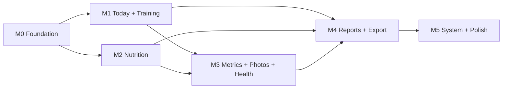

# Sağlık Takip Uygulaması M0–M5 Implementation Roadmap

> **For agentic workers:** REQUIRED SUB-SKILL: Use superpowers:subagent-driven-development (recommended) or superpowers:executing-plans to implement this plan task-by-task. Steps use checkbox (`- [ ]`) syntax for tracking.

**Goal:** Onaylı gereksinim ve tasarım spesifikasyonunun tamamını, her adımı test-first geliştirilen, Claude Fable 5 medium tarafından incelenen, macOS üzerinde doğrulanan ve ayrı commit edilen iOS 17+ uygulamasına dönüştürmek.

**Architecture:** SwiftUI composition root, tek bir yerel Swift package içindeki feature target'ları, SwiftData repository implementasyonları, saf Guidance motoru ve local-first çalışma modeli kullanılacaktır. `project.yml` kanonik proje tanımıdır; `HealthTrackingApp.xcodeproj` XcodeGen ile üretilen ve Git'e alınmayan çıktıdır. Local scheme CloudKit entitlement'ı olmadan çalışır; Cloud scheme yalnız uygun Apple hesabı ve entitlement ile açılır.

**Tech Stack:** Swift 5.9+, SwiftUI, Observation, SwiftData, CloudKit private database, PhotosUI, UserNotifications, Swift Charts, XCTest/XCUITest, XcodeGen 2.46.0+, GitHub Actions `macos-15`, opsiyonel HealthKit v1.1.

## Global Constraints

- Bağlayıcı ürün kaynağı: `Saglik-Takip-App-Gereksinim-Dokumani-v1.md`.
- Bağlayıcı tasarım kaynağı: `docs/superpowers/specs/2026-08-03-health-tracking-app-design.md`.
- Kapsam veya frontend yönü değiştirilemez. Yeni yaratıcı UI kararı gerekirse önce Claude Opus 5 xhigh, sonra Claude Fable 5 medium review ve kullanıcı onayı gerekir.
- Üretim davranışı testten önce yazılamaz. Her davranış için RED kanıtı, minimum GREEN implementasyon, refactor, ilgili suite ve tam suite kanıtı tutulur.
- Her bağımsız roadmap görevi Claude Fable 5 medium tarafından salt-okunur incelenir. Doğrulanmış Critical ve Important bulgular kapanmadan görev tamamlanmaz.
- Her görev tek odaklı son commit bırakır. Windows nedeniyle macOS doğrulaması provisional task commit üzerinden çalışır; gerekirse aynı task commit'i amend edilir. Sonraki göreve yalnız yeşil CI sonrasında geçilir.
- UI hiçbir yerde doğrudan `ModelContext` kullanamaz. Feature view model'leri initializer ile repository protocol alır.
- Core iş kuralları SwiftUI, SwiftData ve CloudKit'ten bağımsız saf değerlerle test edilir.
- Tüm kullanıcı metinleri String Catalog içinden gelir; Türkçe birincildir.
- `0` geçerli bir değer olabilen alanlarda “eksik” anlamına gelmez. Eksik veri opsiyonel alanla temsil edilir.
- Fotoğraf binary'si SwiftData'ya gömülmez. SwiftData CloudKit mirroring ile manuel CKAsset hattı birbirinden ayrıdır.
- Windows statik kontrolleri iOS build kanıtı değildir. Her milestone macOS `xcodebuild` build/test kanıtı gerektirir.
- CloudKit, CKAsset, gerçek bildirim ve HealthKit kabulü simulator sonucu ile kapatılamaz; gerçek Apple ortamı ve gereken üyelik/izinler zorunludur.
- V1 dışı hesap, backend, abonelik, çoklu kullanıcı, Android, iPad-özel UI, Watch, canlı Notion sync, barkod, büyük food DB, food-bileşimli Recipe, widget, rest timer, gamification ve tıbbi yorum için boş UI veya dead-code altyapısı oluşturulmaz.

---

## 1. Kanonik proje ve dosya yapısı

```text
ios_app/
├── App/
│   ├── Application/                 # @main, composition root, app-level routing
│   ├── Resources/                   # App String Catalog, Assets, generated plist
│   └── Support/                     # launch arguments and environment selection
├── Config/
│   ├── Base.xcconfig
│   ├── Debug.xcconfig
│   ├── Release.xcconfig
│   ├── CloudDebug.xcconfig
│   └── CloudRelease.xcconfig
├── Packages/HealthTrackingModules/
│   ├── Package.swift
│   ├── Sources/
│   │   ├── CoreModels/
│   │   ├── PersistenceKit/
│   │   ├── DesignSystem/
│   │   ├── GuidanceKit/
│   │   ├── TrainingKit/
│   │   ├── NutritionKit/
│   │   ├── MetricsKit/
│   │   ├── ProgressPhotosKit/
│   │   ├── SleepMoodKit/
│   │   ├── HealthChecksKit/
│   │   ├── ReportsKit/
│   │   ├── SettingsKit/
│   │   ├── NotificationsKit/
│   │   └── HealthKitBridge/
│   └── Tests/                       # target başına XCTest target'ı
├── HealthTrackingAppUITests/
├── scripts/
│   ├── bootstrap.sh
│   ├── select-simulator.sh
│   ├── test-ios.sh
│   ├── verify-localization.sh
│   └── verify-requirements.sh
├── .github/workflows/ios.yml
├── project.yml                      # tek doğruluk kaynağı
└── README.md
```

Target yalnız teslim ettiği gerçek davranışla birlikte manifest'e eklenir. Gelecek feature adına boş Swift target veya marker type yaratılmaz. Beş tab'ın M0 kök ekranları gerçek route/skeleton davranışı olduğundan M0'da ilgili root feature target'ları oluşturulur.

`HealthTrackingApp.xcodeproj` Git'e alınmaz. Kullanıcı `./scripts/bootstrap.sh` çalıştırdıktan sonra üretilen projeyi Xcode ile açar. CI aynı komutu kullanır ve böylece elle düzenlenmiş `.pbxproj` drift'i oluşmaz.

## 2. Configuration ve doğrulama matrisi

| Configuration / Scheme | Cloud entitlement | Persistence | Amaç |
|---|---:|---|---|
| `HealthTrackingApp-Local` / Debug | Hayır | Yerel SwiftData | Ücretsiz Apple ID, simulator ve ana CI |
| `HealthTrackingApp-Local` / Release | Hayır | Yerel SwiftData | Local-only release smoke |
| `HealthTrackingApp-Cloud` / Cloud Debug | Evet | SwiftData + private CloudKit | Geliştirici hesabı ve cihaz kabulü |
| `HealthTrackingApp-Cloud` / Cloud Release | Evet | SwiftData + private CloudKit | TestFlight/archive adayı |
| Test launch `-ui-testing` | Hayır | In-memory SwiftData | Deterministik XCUITest |

Bundle identifier varsayılanı `com.fatihzxc.HealthTrackingApp`, iCloud container varsayılanı `iCloud.com.fatihzxc.HealthTrackingApp` olacaktır. Bunlar `Config/*.xcconfig` içinde tek noktadan değiştirilebilir; Swift dosyalarında sabitlenmez.

Ana macOS kapısı:

```bash
./scripts/test-ios.sh
```

Bu script bootstrap, dinamik simulator seçimi, package/app/UI testleri ve Local Release build'i birlikte yürütür. CI `macos-15` üzerinde önce mevcut Xcode/XcodeGen sürümlerini loglar, sonra aynı kapıyı çalıştırır. Script `simctl list --json` içinden en yeni kullanılabilir iPhone runtime/device çiftini deterministik seçer; keyfi sabit bir cihaz yüzünden test atlanmaz.

## 3. Her görev için zorunlu yürütme protokolü

Her `Mx.y` görevi aşağıdaki sırayı izler:

- [ ] Görev başlangıç base commit'i ve kapsam dosyaları kaydedilir.
- [ ] Yalnız beklenen davranışı ifade eden test yazılır.
- [ ] Test-only provisional commit task branch'e push edilir; macOS CI'da beklenen nedenle RED kanıtı alınır. Tooling görevinde test-before-tool mümkün değilse başarısız contract komutu ve gerekçesi kaydedilir.
- [ ] Minimum üretim implementasyonu yazılır; ilgili test GREEN yapılır.
- [ ] Refactor sonrasında ilgili target suite ve tam `HealthTrackingApp-Local` suite çalıştırılır.
- [ ] Claude Fable 5 medium yalnız gereksinim, tasarım spec, base commit ve task diff'i okuyarak review yapar.
- [ ] Review bulguları teknik olarak doğrulanır. Critical/Important bulgular düzeltilir; değişen davranış için önce test eklenir.
- [ ] Gerekirse Fable re-review alınır; kalan Critical/Important sıfır olmalıdır.
- [ ] `git diff --check`, placeholder/TODO taraması, lokalizasyon taraması ve task'a özgü statik doğrulama çalıştırılır.
- [ ] Provisional task commit amend edilir ve `--force-with-lease` yalnız task branch'e uygulanır.
- [ ] macOS CI GREEN olduktan sonra commit final kabul edilir; hash ve Actions run URL'si milestone kanıt dosyasına yazılır.
- [ ] Sonraki göreve geçilir.

Review prompt'u en az şu çıktıyı ister: `Critical`, `Important`, `Minor`, requirement coverage, test quality, architecture boundary, accessibility/localization, security/privacy ve `READY/NOT READY`. Review önerisi kullanıcı tarafından kilitlenmiş kararla çelişirse kullanıcı kararı korunur ve gerekçe kayıt altına alınır.

## 4. Milestone bağımlılıkları



M1 ve M2, M0 sonrasında feature branch düzeyinde paralel planlanabilir; ancak aynı package manifest ve app shell dosyalarını aynı anda değiştirmemek için entegrasyon sırası kilitlenir. M3, hem ortak quick-entry desenini hem Nutrition/Training verilerini tükettiği için M1+M2 sonrasıdır. M4 bütün veri kaynaklarına bağlıdır. M5 genel kabul kapısıdır.

---

## 5. M0 — Foundation ve çalışan iskelet

**Milestone goal:** iOS 17+ local-only uygulamayı beş tab ile açan, tam v1 SwiftData şemasını taşıyan, M0 seed'ini idempotent yükleyen, DesignSystem galerisi sunan ve macOS CI'da yeşil kalan temel.

**Detailed plan:** `docs/superpowers/plans/2026-08-03-m0-foundation-implementation.md`

### Görevler

- [ ] **M0.1 — Canonical project ve CI bootstrap:** XcodeGen spec, Local/Cloud configs, scripts, minimal app target ve macOS workflow.
- [ ] **M0.2 — Local package, shared domain values ve validation:** package boundary, bütün persisted enum/değer tipleri, `ReminderSchedule` codec'i ve merkezi set ölçüm validator'ı.
- [ ] **M0.3 — Program ve training SwiftData schema:** UserProfile, Program, ProgramPhase, WorkoutDayTemplate, ExerciseTemplate, WarmupItem, CooldownItem, WorkoutSession, SetLog, ProgramState.
- [ ] **M0.4 — Nutrition, metrics, lifestyle, health ve system schema:** V1 kapsamındaki kalan entity'ler; v1.1 RecipeItem hariç.
- [ ] **M0.5 — Persistence modes ve repository sınırı:** versioned schema, in-memory/local/private CloudKit container factory, Training repository protocol ve SwiftData implementasyonu.
- [ ] **M0.6 — Idempotent M0 seed:** profil, dört fazlı program, A/B/C day shell'leri ve seed manifest; silinen kullanıcı verisini yeniden doğurmayan tekrar çalıştırma.
- [ ] **M0.7 — DesignSystem tokens ve component gallery:** light/dark semantik token'lar, otomatik kontrast testi, tipografi/spacing/radius ve erişilebilir temel bileşenler.
- [ ] **M0.8 — Beş tab app shell ve raw seed görünümü:** Today/Training/Nutrition/Progress/Settings root'ları, route ownership, loading/empty/error ve Türkçe String Catalog.
- [ ] **M0.9 — M0 acceptance ve novice README:** UI/accessibility smoke, local/cloud build contract, bootstrap/run/device yönergesi ve milestone evidence.

### Çıkış kapısı

- [ ] Local scheme Debug ve Release simulator build eder.
- [ ] Package unit/contract testleri ile XCUITest suite yeşildir.
- [ ] İlk açılışta bir UserProfile, bir aktif Program, dört ProgramPhase ve A/B/C sıralı üç day shell görünür.
- [ ] İkinci/üçüncü seed çalıştırması kayıt sayısını değiştirmez.
- [ ] Beş tab erişilebilir etiketiyle açılır; hiçbir root crash veya sahte aksiyon üretmez.
- [ ] Light/dark ana metin ve aksiyon token çiftleri WCAG eşiklerini otomatik geçer.
- [ ] Cloud scheme compile edilir; gerçek sync henüz iddia edilmez.

---

## 6. M1 — Bugün ve Antrenman

**Milestone goal:** Kullanıcının açılışta direktif aldığı, A/B/C programını uçtan uca kaydettiği ve onaylı rehber kurallarının deterministik çalıştığı MVP çekirdeği.

M1 başlamadan ayrı ayrıntılı plan yazılacak ve review edilecektir: `docs/superpowers/plans/2026-08-03-m1-training-implementation.md`.

### Görevler

- [ ] **M1.1 — Tam seed catalog:** 27 ayrı ExerciseTemplate, Curl/Triceps superset ilişkisi, gün-özel warmup, ortak cooldown ve üç health-check reminder; bağlayıcı ölçüm eşlemesi fixture testleri.
- [ ] **M1.2 — Guidance rotation:** in-progress resume üstünlüğü, A→B→C, aynı-gün engeli, ardışık gün/haftalık hedef dinlenmesi ve explicit override.
- [ ] **M1.3 — Set invariant ve draft state:** weight/reps/duration/steps/quality kayıt barı; invalid ölçüm persist edilemez.
- [ ] **M1.4 — Session lifecycle:** planned→inProgress→completed/skipped, relaunch restore, interruption sheet ve güvenli partial data.
- [ ] **M1.5 — Warmup/movement/cooldown/summary UI:** tek elle kullanım, önceki set prefill, güvenlik notu ve failure uyarıları.
- [ ] **M1.6 — Strict double progression:** bütün setler `repHigh`, bütün RIR mevcut ve `rir <= rirLow`; aksi halde kilo artışı yok.
- [ ] **M1.7 — Bodyweight ve Pallof progression:** varyasyon kaydı, nil rep ceiling davranışı, haftalık Pallof seçimi.
- [ ] **M1.8 — OHP gate:** 1–2/3–4/5+ hafta varyantları, önceki seans semptom sorusu, current symptom stop ve Half-Kneeling alternatifi.
- [ ] **M1.9 — Equipment ceiling ve phase focus:** 20 kg clamp, tempo/tek taraflı sırası, Faz 3 `boneFocusHeavy` alt bant yönlendirmesi.
- [ ] **M1.10 — Scheduled/reactive deload:** 1 tabanlı hafta sayacı, `% 5`, iki seans stagnation, accept/stay/technique/skip state machine.
- [ ] **M1.11 — Phase transition:** tarih tahmini, checklist, kullanıcı onayı ve manuel phase set; uydurma eşik yok.
- [ ] **M1.12 — Personal-record detection:** yüklü tekrarda merkezi Epley tahmini 1RM, aynı varyant bodyweight tekrar/süre ve aynı veya daha yüksek yükte adım karşılaştırması; ilk kayıt baseline, konfeti/rozet yok.
- [ ] **M1.13 — History/edit/delete:** kronolojik seans geçmişi, geçmiş set düzeltme, öneri/PR hesaplarının güncellenmesi ve destructive confirmation.
- [ ] **M1.14 — Today variants ve launch performance:** session/rest/deload/phase/reminder/nutrition foundation bileşimi; soğuk açılış direktifi ≤1 saniye ölçümü.
- [ ] **M1.15 — Haptic feedback contract:** set kaydında medium impact, throttle edilmiş stepper selection, PR/faz başarısı, güvenlik/deload warning ve error; enjekte edilen client ve persisted kill-switch değerine uyum.
- [ ] **M1.16 — Training accessibility acceptance:** VoiceOver focus sırası, Dynamic Type, Reduce Motion, ≤2 dokunuş set akışı ve tam M1 audit.

### Çıkış kapısı

- [ ] US1, US2, US3 ve US9(deload) otomatik ve UI kanıtıyla geçer.
- [ ] Bir haftalık A/B/C döngüsü, resume ve history çalışır.
- [ ] Eksik RIR hiçbir koşulda +2.5 kg üretmez.
- [ ] OHP semptom kapısı kullanıcı cevabı olmadan artış üretmez.
- [ ] Tüm 27 seed exercise ölçüm türü ve güvenlik notu doğru görünür.
- [ ] Deterministik PR karşılaştırmaları ilk kaydı baseline sayar ve yalnız yeni rekoru ölçülü biçimde vurgular.
- [ ] Training haptic olayları doğru semantiğe, throttle'a ve kill-switch'e uyar; hiçbir anlam yalnız titreşimle verilmez.

---

## 7. M2 — Beslenme

**Milestone goal:** Gün bazlı hızlı beslenme kaydı, direct-macro tarif kütüphanesi ve geçmişi bozmayan snapshot makroları.

M2 başlamadan ayrıntılı plan: `docs/superpowers/plans/2026-08-03-m2-nutrition-implementation.md`.

### Görevler

- [ ] **M2.1 — Nutrition repository contracts:** gün başlangıcı normalizasyonu, günlük log fetch-or-create ve CRUD contract suite.
- [ ] **M2.2 — Macro math:** decimal-safe toplam, hedef var/yok sunumu, negatif/NaN/sonsuz değer validation.
- [ ] **M2.3 — Food library:** user-created Food arama, ekleme, düzenleme ve silme.
- [ ] **M2.4 — Direct-macro Recipe library:** kategori/custom kategori, serving ölçekleme ve arşivleme/silme davranışı.
- [ ] **M2.5 — MealEntry snapshot:** recipe/food/ad-hoc kaydı sırasında resolved makrolar; kaynak sonra değişse de geçmiş immutable.
- [ ] **M2.6 — Daily calendar UI:** tarih ileri/geri, kategori bölümleri, anlık toplam ve loading/empty/error.
- [ ] **M2.7 — Three-tap saved meal:** gün→kategori→tarif akışı ve VoiceOver kabulü.
- [ ] **M2.8 — M2 audit:** US4/US5, tarih sınırları/timezone, relaunch persistence ve full suite.

### Çıkış kapısı

- [ ] Kayıtlı tarif bugüne ≤3 dokunuşla eklenir.
- [ ] Toplamlar anında ve hedeflerin opsiyonel oluşuna uygun güncellenir.
- [ ] Tarif/Food düzenlemek eski MealEntry snapshot'larını değiştirmez.
- [ ] Aynı yerel gün için tek mantıksal DailyNutritionLog vardır.

---

## 8. M3 — Metrikler, fotoğraf, yaşam ve sağlık

**Milestone goal:** Tüm kişisel tracker'larda güvenli hızlı giriş, yerel fotoğraf yaşam döngüsü, health-check recurrence ve tıbbi olmayan güvenlik katmanları.

M3 başlamadan ayrıntılı plan: `docs/superpowers/plans/2026-08-03-m3-trackers-implementation.md`.

### Görevler

- [ ] **M3.1 — Shared quick-entry pattern:** save state, validation, undo/error ve erişilebilir form davranışı.
- [ ] **M3.2 — BodyMetric:** kilo/bel/custom, unit validation ve tek ekran hızlı giriş.
- [ ] **M3.3 — Sleep/Mood:** süre/kalite, mood score/tags, energy ve aynı gün düzenleme politikası.
- [ ] **M3.4 — Posture/Symptom:** wall test, 0–10 skor, region, haftalık hızlı giriş ve OHP event entegrasyonu.
- [ ] **M3.5 — Health check recurrence:** due/pending/done, monthly/quarterly/yearly calendar arithmetic ve yeni vade üretimi.
- [ ] **M3.6 — Bloodwork reference:** sonuç CRUD, unit koruması ve her bağlamda tıbbi olmayan ibare.
- [ ] **M3.7 — Local photo asset store:** PhotosUI import, metadata/orientation normalization, Application Support atomik write, thumbnail ve delete cleanup.
- [ ] **M3.8 — Photo gallery/compare:** tarih/poz sırası, iki foto seçimi, missing/corrupt file fallback.
- [ ] **M3.9 — Manual CKAsset adapter:** ayrı record zone, upload/download, retry/backoff, cleanup queue, account changes, change token ve backfill.
- [ ] **M3.10 — Medical safety L0/L1/L2:** bilgi, dikkat ve stop durumları; servikal red-flag metni; teşhis/yorum yok.
- [ ] **M3.11 — Health-check notification integration:** tek schedule kaynağı, due-date reschedule ve gerçek cihaz kanıt planı.
- [ ] **M3.12 — M3 audit:** US6/US8, disk failure, permission denied, offline/iCloud-off ve tracker accessibility.

### Çıkış kapısı

- [ ] BodyMetric, SleepLog, MoodLog, PostureMetric, HealthCheckReminder ve BloodworkResult uçtan uca persist edilir.
- [ ] Fotoğraf local-only modda tamamen çalışır; binary SwiftData içinde değildir.
- [ ] CKAsset cross-device ancak iki gerçek cihaz/hesap ortamı kanıtıyla “geçti” sayılır.
- [ ] Tıbbi bağlamların tamamında bağlayıcı ibare görünür.

---

## 9. M4 — Raporlar ve export

**Milestone goal:** Seçili aralıkta dürüst grafikler, erişilebilir özetler ve paylaşılabilir, schema-versioned dışa aktarım.

M4 başlamadan ayrıntılı plan: `docs/superpowers/plans/2026-08-03-m4-reports-implementation.md`.

### Görevler

- [ ] **M4.1 — DateRange ve dataset builders:** 1A/3A/6A/1Y, local calendar sınırları, missing/partial veri.
- [ ] **M4.2 — Body/strength charts:** kilo, bel, hacim ve gerekli koşullar oluştuğunda M1'deki tek merkezi PR/Epley fonksiyonunu kullanan tahmini 1RM; uydurma sıfır yok.
- [ ] **M4.3 — Nutrition adherence:** protein hedef günleri, hedefsiz gün exclusion ve yüzdelik payda doğruluğu.
- [ ] **M4.4 — Lifestyle/posture/phase charts:** uyku, mood, semptom ve kullanıcı onaylı phase timeline.
- [ ] **M4.5 — Photo compare integration:** erişilebilir seçim, gizlilik ve share-safe rendering.
- [ ] **M4.6 — CSV export:** sabit kolon sözleşmeleri, locale-independent decimal/date ve RFC 4180 escaping.
- [ ] **M4.7 — JSON/ZIP export:** `schemaVersion`, manifest, ilgili CSV/JSON ve yalnız kullanıcının açık opt-in'iyle foto asset'leri; temp cleanup. Foto seçeneği tasarım §13'teki “bütün veriyi export” hakkını uygular, §9.5 CSV/JSON/ZIP format sınırını değiştirmez.
- [ ] **M4.8 — Audio Graphs/accessibility:** chart descriptor, sonification ve text-table fallback.
- [ ] **M4.9 — M4 audit:** US7, round-trip fixture, büyük veri performansı ve share sheet.

### Çıkış kapısı

- [ ] Kilo, bel, en az bir hareket ve protein uyumu grafikleri doğru veriyle görünür.
- [ ] Uyku, mood, posture ve phase görselleştirmeleri missing veriyi yanlış sonuç diye sunmaz.
- [ ] CSV ve JSON schema testleri, escaping ve paylaşım geçer; ZIP içeriği manifest ile doğrulanır.

---

## 10. M5 — Sistem, entegrasyon ve cila

**Milestone goal:** Ayarlar, bildirimler, gerçek CloudKit kabulü, opsiyonel HealthKit v1.1, tam erişilebilirlik ve kullanıcıya yönelik kurulum/dağıtım teslimi.

M5 başlamadan ayrıntılı plan: `docs/superpowers/plans/2026-08-03-m5-system-polish-implementation.md`.

### Görevler

- [ ] **M5.1 — Settings/profile/targets:** metric/imperial presentation, 1–7 weekly target, program/phase management, validation ve bütün haptic'leri kapatan erişilebilir kill-switch.
- [ ] **M5.2 — ReminderSchedule codec/settings:** oneTime/daily/weekly/intervalDays edit UI ve invalid persisted JSON fallback.
- [ ] **M5.3 — Notification planner:** workout/measurement/bloodwork/meal, idempotent pending requests, rest-day removal, permission states ve güvenli notification deep-link route çözümü.
- [ ] **M5.4 — iCloud account status:** available/restricted/noAccount/temporarilyUnavailable, local data preservation ve kullanıcıya dürüst durum.
- [ ] **M5.5 — Full data deletion:** typed destructive confirmation, bütün SwiftData kayıtları/local foto dosyaları/pending notifications, CKAsset cleanup sözleşmesi ve sessiz seed resurrection üretmeyen test edilmiş post-wipe durum.
- [ ] **M5.6 — SwiftData CloudKit device acceptance:** private DB, fresh device restore, edits/deletes, offline/reconnect ve account switch; CloudKit background notification capability burada eklenir ve gerçek imzayla doğrulanır.
- [ ] **M5.7 — CKAsset device acceptance:** upload/download/backfill/delete/retry, iki cihaz ve local cache rebuild.
- [ ] **M5.8 — Optional HealthKit v1.1:** ayrı `HealthKitBridge`, granular permission, denied fallback ve çekirdeğin bağımsızlığı.
- [ ] **M5.9 — Full accessibility matrix:** VoiceOver, Dynamic Type tüm boyutlar, Reduce Motion, Increase Contrast, Differentiate Without Color, keyboard/switch focus.
- [ ] **M5.10 — Performance/privacy/security:** launch ≤1s directive, large history, file protection, log redaction, export cleanup ve permission rationale.
- [ ] **M5.11 — README/device/TestFlight guide:** Swift bilmeyen kullanıcı için bootstrap, simulator, Personal Team, paid membership, iCloud, HealthKit ve troubleshooting.
- [ ] **M5.12 — Final requirement trace audit:** bütün IN/OUT, entity, US, algorithm, seed ve DoD satırlarının kanıt bağlantısı.
- [ ] **M5.13 — Release candidate:** Local archive, Cloud archive/TestFlight uygunluğu, checksums ve açık blokaj raporu.

### Çıkış kapısı

- [ ] Tüm Bölüm 15 DoD maddeleri kanıt bağlantısıyla `PASS` veya dış bağımlılık varsa dürüst `BLOCKED` durumundadır.
- [ ] CloudKit üyeliği yoksa Local scheme tam kabul edilir; CloudKit maddesi geçilmiş gibi raporlanmaz.
- [ ] Gerçek notification ve HealthKit yalnız cihaz kanıtıyla kapanır.
- [ ] README ile Swift bilmeyen kullanıcı projeyi üretip simulator'da çalıştırabilir.
- [ ] Tam veri silme yerel kayıt, dosya ve pending notification'ı temizler; cloud cleanup/post-wipe seed davranışı test ve kanıtla açıklanır.

---

## 11. Gereksinim izlenebilirlik matrisi

| Kaynak alanı | Ana milestone | Kanıt türü |
|---|---|---|
| Bölüm 5 teknoloji/mimari | M0, M5 | project dump, dependency audit, build |
| Bölüm 6 veri modeli | M0 | schema inventory + in-memory container tests |
| 7.1 Bugün | M1 | Guidance/ViewModel/UI/performance |
| 7.2 Antrenman | M1 | unit + repository + UI + accessibility |
| 7.3 Beslenme | M2 | macro/snapshot unit + UI |
| 7.4 Metrik/foto | M3 | repository/file/integration/UI |
| 7.5 Uyku/ruh hali | M3 | repository/ViewModel/UI |
| 7.6 Kan değerleri | M3 | recurrence/safety/UI |
| 7.7 Postür | M3, M4 | repository + chart |
| 7.8 Rapor/export | M4 | dataset/schema/round-trip/UI |
| 7.9 Bildirimler | M3, M5 | planner unit + device |
| Bölüm 8 beş tab | M0 | XCUITest |
| Bölüm 9 guidance algoritmaları | M1 | saf exhaustive unit suite |
| Bölüm 10 seed | M0 shell, M1 full | fixture + idempotency + UI inventory |
| Bölüm 11 UX | M0–M5 | design token + flow + accessibility audit |
| Bölüm 12 gizlilik | M3–M5 | storage/log/export/account tests |
| Bölüm 15 DoD | M5 | final trace audit |
| Bölüm 16 kurulum | M0 bootstrap, M5 final | clean-clone runbook test |

## 12. Milestone kanıt dosyaları

Her milestone sonunda `docs/evidence/Mx/acceptance.md` oluşturulur ve yalnız kanıt bağlantıları içerir:

- final task commit hash'leri,
- Fable review sonucu ve kapanan bulgular,
- GitHub Actions run URL'leri,
- test sayıları ve kullanılan destination/Xcode sürümü,
- simulator screenshot/XCResult artifact adları,
- device-only test tarihi/cihazı/OS'i (varsa),
- `PASS`, `FAIL` veya `BLOCKED` kabul matrisi,
- açık riskler ve dış bağımlılıklar.

Kanıt olmadan “derleniyor”, “senkron oluyor”, “çalışıyor” veya “tamamlandı” ifadesi kullanılmaz.

## 13. Dış kapılar ve durma koşulları

- GitHub Actions kapalıysa veya macOS dakikası yoksa milestone macOS kapısı kullanıcı Mac'i sağlanana kadar blokaj olarak raporlanır.
- CloudKit container/capability oluşturulamıyorsa local çalışma devam eder; yalnız Cloud acceptance durur.
- Gerçek iPhone yoksa notification, HealthKit ve cross-device CKAsset maddeleri simulator ile geçirilmez.
- Gereksinimde tanımlanmamış tıbbi eşik, güç formülü veya progression sayısı gerekirse uygulanmaz; kullanıcı kararı için durulur.
- App Store/TestFlight dış dağıtımı ayrıca dış sistem değişikliği olduğundan kullanıcı yetkisi ve uygun hesap olmadan yapılmaz.

## 14. Bağlayıcı teknik kaynaklar

- Apple SwiftData model configuration: <https://developer.apple.com/documentation/swiftdata/modelconfiguration>
- Apple SwiftData model persistence: <https://developer.apple.com/documentation/swiftdata/preserving-your-apps-model-data-across-launches>
- Apple SwiftData + CloudKit sync: <https://developer.apple.com/documentation/swiftdata/syncing-model-data-across-a-persons-devices>
- Apple CKAsset: <https://developer.apple.com/documentation/cloudkit/ckasset>
- Apple capability availability: <https://developer.apple.com/help/account/reference/supported-capabilities-ios>
- Apple membership comparison: <https://developer.apple.com/support/compare-memberships/>
- XcodeGen project spec: <https://github.com/yonaskolb/XcodeGen/blob/master/Docs/ProjectSpec.md>
- GitHub hosted runner labels: <https://docs.github.com/en/actions/how-tos/write-workflows/choose-where-workflows-run/choose-the-runner-for-a-job>
