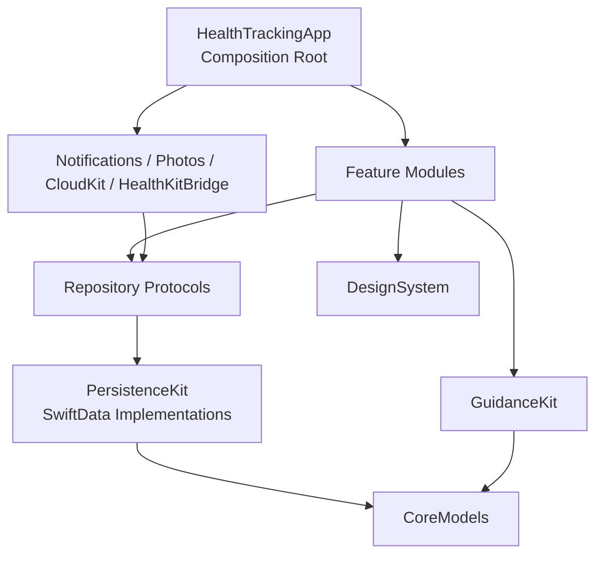

# Sağlık ve Antrenman Takip Uygulaması — Onaylı Tasarım Spesifikasyonu

- **Durum:** Kullanıcı tarafından onaylandı
- **Tarih:** 2026-08-03
- **Birincil gereksinim kaynağı:** `Saglik-Takip-App-Gereksinim-Dokumani-v1.md`
- **Platform:** iPhone, iOS 17 ve üzeri
- **Ürün dili:** Türkçe birincil, tüm kullanıcı metinleri lokalize edilebilir
- **Tasarım ajanı:** Claude Opus 5, xhigh
- **Bağımsız tasarım review:** Claude Fable 5, medium — `PASS WITH CHANGES`
- **Onaylanan yön:** Brifing

Bu belge kaynak gereksinim dokümanını değiştirmez. Kaynak dokümandaki ürün kapsamını uygulanabilir ekran, etkileşim, mimari ve veri sözleşmelerine dönüştürür. Çelişki halinde yalnız Bölüm 1’de özetlenen ve Bölüm 4’te ayrıntılandırılan kullanıcı onaylı düzeltmeler bu belge üzerinden uygulanır; diğer konularda kaynak gereksinim dokümanı önceliklidir.

---

## 1. Onaylanan karar özeti

| Konu | Onaylanan karar |
|---|---|
| Görsel yön | Tipografi liderli “Brifing”; kart yığını yerine her ekranda tek baskın direktif |
| Navigasyon | Bugün, Antrenman, Beslenme, İlerleme, Ayarlar olmak üzere beş sekme |
| Bugün ekranı | Faz, tek net direktif, öncelikli tek uyarı, ana eylem ve bağlamsal hızlı girişler |
| Seans | Tam ekran Isınma → Hareketler → Soğuma → Özet akışı |
| Set kaydı | Ön-dolumla bir dokunuş; yalnız değer veya yalnız RIR değişirse iki dokunuş; ikisi birlikte değişirse açık düzenleme sheet’i |
| Öğün kaydı | Kayıtlı tarifin kategoriye en fazla üç dokunuşta eklenmesi |
| Deload | Banner değil, bütün önerileri etkileyen kalıcı seans modu |
| Faz geçişi | Otomatik tahmin edilir fakat yalnız kullanıcı onayıyla etkinleşir |
| OHP kapısı | Önceki seans sırasında veya ertesi gün semptom yoksa artışa izin |
| RIR | Kayıt yoksa ağırlık artışı önerilmez |
| Süre/adım setleri | `SetLog` süre, adım ve gerçekleştirilen varyantı saklar |
| Vücut ağırlığı | Otomatik +2.5 kg yerine varyasyon zorluğu veya bant desteği ilerletilir |
| Süperset | Hareketler ayrı kayıt edilir ve ortak bir grup kimliğiyle sunulur |
| iCloud | Local-first SwiftData, CloudKit private database ve otomatik birleştirme; özel çatışma ekranı yok |
| HealthKit | v1.1; izin reddinde çekirdek ve manuel giriş çalışmaya devam eder |
| Export | CSV ve JSON; ikisi birlikte ZIP olarak paylaşılabilir |
| Kutlama | Yalnız kişisel rekor ve faz geçişinde ölçülü vurgu; streak, rozet ve konfeti yok |
| Widget | v1 kapsamı dışında |
| Tarif bileşimi | v1’de doğrudan makro; Food bileşimi v1.1 |
| Dinlenme sayacı | v1 kapsamı dışında |
| Ekipman tavanı | Belgede belirtildiği gibi 20 kg’da uyarı; 17.5 kg ön uyarısı yok |

---

## 2. Ürün tasarım ilkeleri

### 2.1 Direktif, pano değil

Uygulamanın ana vaadi “ne yaptığını göstermek” değil, “şimdi ne yapacağını söylemek”tir. Bugün ve seans ekranlarında birincil eylem tek bakışta anlaşılır. Veri yoğunluğu yalnız geçmiş, grafik ve rapor ekranlarında yükselir.

### 2.2 Salonda tek elle kullanım

Seans ekranı terli el, bölünmüş dikkat ve telefonun uzakta durması koşullarıyla tasarlanır:

- Seans içi dokunma hedefleri en az 52 pt’dir.
- Birincil eylem ekranın alt yüzde 35’inde kalır.
- Hassas sürükleme hareketleri zorunlu değildir.
- Kayıt değerleri önceden doldurulur.
- Yanlışlıkla ilerlemeyi önlemek için son set sonrası otomatik ekran geçişi yapılmaz.

### 2.3 Güvenlik akışın parçasıdır

OHP semptom kapısı, “faile gitme” notu, servikal uyarılar ve deload davranışı dekoratif bilgi değildir. Gerektiğinde öneriyi sınırlar, eylemi durdurur ve güvenli alternatifi açıklar.

### 2.4 Progressive disclosure

Kritik direktif ve eylem ilk katmandadır. Gerekçe, geçmiş, grafik ve düzenleme ayrıntıları kullanıcı istediğinde açılır. Hiçbir temel karar yalnız renk, ikon veya gizli jestle anlatılmaz.

### 2.5 Local-first güven

Kullanıcının kaydı önce cihazda tamamlanır. Ağ veya iCloud durumu seans ve öğün kaydını engellemez. Uygulama senkronizasyonu olduğundan daha ayrıntılı göstermeye çalışmaz ve sessiz veri kaybı vaat etmez.

---

## 3. Sistem mimarisi

### 3.1 Katmanlar ve bağımlılık yönü

Bağımlılıklar yalnız aşağıdaki yönde akar:

1. `HealthTrackingApp` composition root bağımlılıkları kurar.
2. Feature view ve view model’leri repository protokollerini tüketir.
3. Repository protokolleri ilgili feature’ın sahipliğindedir.
4. `PersistenceKit` bu protokollerin SwiftData implementasyonlarını sağlar.
5. `GuidanceKit` saf ve test edilebilir kuralları barındırır; SwiftUI veya CloudKit bilmez.
6. `DesignSystem` yalnız sunum token’ları ve tekrar kullanılabilir görsel bileşenler sağlar.

### 3.2 Modüller

| Modül | Sorumluluk |
|---|---|
| `HealthTrackingApp` | Uygulama yaşam döngüsü, dependency composition, `TabView` ve app-level routing |
| `CoreModels` | SwiftData entity’leri, paylaşılan enum’lar ve değer tipleri |
| `PersistenceKit` | Model container, SwiftData repository’leri, seed koordinasyonu |
| `DesignSystem` | Semantik renkler, tipografi, spacing, bileşenler, erişilebilir davranışlar |
| `GuidanceKit` | Sıradaki seans, çift progresyon, bodyweight progresyonu, OHP kapısı, deload, faz |
| `TrainingKit` | Program, seans, set kaydı ve geçmiş |
| `NutritionKit` | Food, Recipe, DailyNutritionLog, MealEntry ve makro toplamları |
| `MetricsKit` | BodyMetric ve PostureMetric |
| `ProgressPhotosKit` | PhotosUI seçimi, uygulama container dosyaları ve karşılaştırma |
| `SleepMoodKit` | SleepLog ve MoodLog |
| `HealthChecksKit` | Hatırlatmalar, BloodworkResult ve tıbbi olmayan ibareler |
| `ReportsKit` | Swift Charts veri setleri, tarih aralığı ve CSV/JSON export |
| `SettingsKit` | Profil, hedefler, birimler, bildirimler, veri ve iCloud hesap durumu |
| `NotificationsKit` | Local notification izinleri ve planlama |
| `HealthKitBridge` | v1.1’de opsiyonel HealthKit okuma/yazma adaptörü |

Apple’ın `WorkoutKit` adıyla çakışmayı önlemek için antrenman modülünün adı `TrainingKit`’tir. `CoreModels` adı, SwiftData kullanılmasına rağmen Core Data kullanıldığı izlenimini vermemek için tercih edilir.

Bu sınırlar Xcode app target’ı ve yerel Swift Package target’ları olarak uygulanır. Bir feature başka bir feature’ın view katmanına doğrudan bağlanmaz; paylaşılan davranış yalnız açık protocol veya ortak model üzerinden geçer.

### 3.3 Repository sözleşmesi

Her feature kendi veri erişim protokolünü tanımlar. Örnek sorumluluklar:

- `WorkoutRepository`: program, şablon, seans ve set sorguları
- `NutritionRepository`: tarif, food, günlük kayıt ve öğün işlemleri
- `MetricsRepository`: vücut ve postür kayıtları
- `LifestyleRepository`: uyku ve ruh hali
- `HealthChecksRepository`: hatırlatma ve sonuçlar
- `ReportsRepository`: export için salt-okunur birleşik sorgular
- `ProgramStateRepository`: aktif faz ve deload durumu

UI hiçbir yerde doğrudan `ModelContext` kullanmaz. View model’ler `@Observable` olur ve protokoller initializer ile enjekte edilir. Remote backend gelecekte aynı sözleşmeleri uygulayabilir; v1’de remote implementasyon oluşturulmaz.

---

## 4. Veri modeli düzeltmeleri

Kaynak doküman Bölüm 6’daki bütün entity’ler korunur. Aşağıdaki onaylı düzeltmeler, kaynak modelin gerçek seed ve rehber davranışlarını taşıyamayan noktalarını tamamlar.

### 4.1 `ExerciseTemplate` ek alanları

| Alan | Tip | Kural |
|---|---|---|
| `measurementKind` | `ExerciseMeasurementKind` | `weightReps`, `reps`, `duration`, `steps` veya `quality` |
| `supersetGroupId` | `UUID?` | Aynı süpersetteki ayrı hareketleri ilişkilendirir |
| `supersetOrder` | `Int?` | Grup içi gösterim sırası |
| `progressionRule` | mevcut enum + `bodyweightProgression` | Vücut ağırlığı hareketlerini +2.5 kg kuralından ayırır |
| `repLow` / `repHigh` | `Int?` | Kaynak seed’de aralık verilmeyen hareketi yapay bir hedef uydurmadan temsil eder |

Curl ve Triceps ayrı `ExerciseTemplate` kayıtlarıdır; seed’de aynı `supersetGroupId` ile gruplanır. Plank/Pallof gibi seçimli satırlar tek şablon olabilir ancak yapılan seçim her sette `performedVariant` olarak saklanır.

Kaynak seed’de “Pull-up / bantlı” için tekrar aralığı verilmediğinden bu şablonda `repLow` ve `repHigh` nil kalır. UI hedefi “Teknik izin verdiğince · RIR 1–2” olarak gösterir; motor sayısal üst sınır uydurmaz ve bant azaltmayı otomatik önermez. Diğer bütün seed hareketlerinde belgede verilen tekrar aralıkları aynen korunur.

#### Seed ölçüm eşlemesi

| Gün | Hareket | `measurementKind` | Progresyon kaydı |
|---|---|---|---|
| A | Goblet Squat | `weightReps` | `doubleProgression` |
| A | Chin-up | `reps` | `bodyweightProgression` |
| A | DB Floor Press | `weightReps` | `doubleProgression` |
| A | DB Romanian Deadlift | `weightReps` | `doubleProgression` |
| A | Prone Y-T-W | `reps` | `timeQuality` |
| A | Face Pull (bant) | `reps` | `timeQuality`; bant `performedVariant` ile |
| A | Tek Bacak Calf Raise | `reps` | `doubleProgression`; harici yük opsiyonel |
| A | Plank / Pallof | `duration` | `timeQuality`; seçim `performedVariant` ile |
| B | DB RDL (çift) | `weightReps` | `doubleProgression` |
| B | Tek Kol DB Row | `weightReps` | `doubleProgression` |
| B | Push-up | `reps` | `bodyweightProgression` |
| B | DB Overhead Press | `weightReps` | `gradedEntryOHP` |
| B | Bulgarian Split Squat | `weightReps` | `doubleProgression` |
| B | Glute Bridge / Hip Thrust | `reps` | `doubleProgression`; harici yük opsiyonel |
| B | Wall Slide | `reps` | `timeQuality` |
| B | Dead Bug | `reps` | `timeQuality` |
| B | Copenhagen Plank | `duration` | `timeQuality` |
| C | Reverse Lunge (DB) | `weightReps` | `doubleProgression` |
| C | Nordic Hamstring Curl | `reps` | `timeQuality` |
| C | Pull-up / bantlı | `reps` | `bodyweightProgression`; tekrar aralığı nil |
| C | Bantlı / Tek Kol Row | `reps` | `doubleProgression`; varyanta göre bant veya opsiyonel DB yükü |
| C | Half-Kneeling DB Press | `weightReps` | `doubleProgression` |
| C | DB Lateral Raise | `weightReps` | `doubleProgression` |
| C | Farmer’s Carry | `steps` | `timeQuality`; harici yük opsiyonel |
| C | Curl | `weightReps` | `doubleProgression`; başlangıç 10 kg |
| C | Triceps | `reps` | `doubleProgression`; başlangıç ağırlığı nil ve ilk kayıtta kullanıcı seçer |
| C | Side Plank / Pallof | `duration` | `timeQuality`; seçim `performedVariant` ile |

`doubleProgression`, yalnız kayıtta gerçek bir harici `weightKg` varsa otomatik +2.5 kg üretebilir. `reps` türünde yük nil ise motor kilogram uydurmaz; aynı varyasyonda tekrar/kaliteyi korur ve kullanıcıya yük veya varyasyon seçimi gerektiğini açıklar. Bant direnci kilogram olarak çevrilmez; bant rengi/yardım seviyesi `performedVariant` içinde saklanır. `measurementKind` yalnız `progressionRule` değerinden türetilmez; seed tablosu bağlayıcıdır.

### 4.2 `SetLog` ölçüm alanları

`weightKg` ve `reps`, süre/adım/kalite setlerinde yapay sıfır yazmamak için opsiyonel hale gelir. Ek alanlar:

| Alan | Tip | Açıklama |
|---|---|---|
| `durationSec` | `Int?` | Plank ve süre temelli kayıt |
| `distanceSteps` | `Int?` | Farmer’s Carry gibi adım temelli kayıt |
| `performedVariant` | `String?` | Plank/Pallof veya benzer seçim |
| `rir` | `Int?` | Kaydedilmezse artış önerisi üretilemez |

Ölçüm invariant’ları:

- `weightReps`: `weightKg` ve `reps` zorunlu
- `reps`: `reps` zorunlu, `weightKg` opsiyonel
- `duration`: `durationSec` zorunlu
- `steps`: `distanceSteps` zorunlu, `weightKg` opsiyonel
- `quality`: bir set kaydının varlığı tamamlanmayı ifade eder; tekrar veya süre yalnız şablon gerektirirse girilir

Invariant doğrulaması tek bir domain validator’da yapılır; view’lar kuralları kopyalamaz.

### 4.3 `ProgramState`

Kaynak dokümandaki haftalık hedef ayarı `UserProfile.weeklyWorkoutTarget: Int` alanında saklanır; varsayılan 3, geçerli aralık 1–7’dir.

Aktif program başına tek mantıksal kayıt bulunur:

| Alan | Tip | Açıklama |
|---|---|---|
| `programId` | `UUID` | İlgili program |
| `currentPhaseId` | `UUID` | Kullanıcının onayladığı aktif faz |
| `phaseStartedAt` | `Date` | Manuel veya onaylı geçiş tarihi |
| `trainingWeekIndex` | `Int` | 1 tabanlı zamanlı deload değerlendirmesi; ilk antrenman haftası = 1 |
| `deloadStatus` | `DeloadStatus` | `none`, `recommended`, `active`, `skipped` |
| `deloadReason` | `DeloadReason?` | `scheduled` veya `reactive` |
| `deloadUpdatedAt` | `Date?` | Son karar zamanı |
| `lastDeloadSkippedAt` | `Date?` | Atlamanın kayda alınması |
| `lastDeloadAction` | `DeloadAction?` | `accepted`, `stay`, `techniqueReview` veya `skipped` |

“Tek kayıt” garantisi SwiftData unique constraint ile değil repository seviyesinde idempotent fetch-or-create işlemiyle sağlanır; CloudKit uyumluluğu korunur.

`trainingWeekIndex`, `programStartDate` temel alınarak yerel takvim haftası değiştiğinde ve o haftada en az bir seans tamamlandığında ilerler. Aynı hafta içindeki ek seanslar sayacı artırmaz. `deloadStatus == skipped`, yeni bir antrenman haftası başladığında `none` durumuna döner; sonraki zamanlı veya reaktif değerlendirme yeniden öneri üretebilir. Program başlangıç tarihi kullanıcı tarafından değiştirilirse repository sayacı deterministik biçimde yeniden hesaplar.

### 4.4 OHP semptom sonucu

`WorkoutSession` aşağıdaki alanlarla genişler:

| Alan | Tip | Açıklama |
|---|---|---|
| `ohpSymptomResponse` | `OHPSymptomResponse` | `notAsked`, `symptomFree`, `symptomsPresent` veya `uncertain` |
| `ohpSymptomCheckedAt` | `Date?` | Önceki seans için yanıt zamanı |

Bir sonraki OHP seansı başında verilen yanıt önceki OHP seansına yazılır. Seans sırasında “Şu an semptom var” eylemi güncel seansı doğrudan `symptomsPresent` yapar.

### 4.5 CloudKit uyumluluğu

- SwiftData modellerinin CloudKit’e yansıyan ilişkileri opsiyonel tanımlanır.
- Gerekli scalar alanlara güvenli varsayılanlar verilir.
- `DailyNutritionLog.date` benzersizliği uygulama/repository katmanında gün başlangıcına normalize edilerek sağlanır.
- Test konfigürasyonu in-memory SwiftData kullanır ve CloudKit içermez.
- Üretim konfigürasyonu CloudKit private database kullanır.
- Özel “iki sürümü karşılaştır” çatışma ekranı oluşturulmaz; SwiftData/CloudKit otomatik birleştirme davranışı kullanılır.

### 4.6 Fotoğraf dosya saklama

`ProgressPhoto.imageRef`, cihaz dosya sistemindeki mutlak yol değil, uygulama tarafından üretilen kararlı bir asset kimliğidir. `ProgressPhotosKit` içindeki `PhotoAssetStore` şu sözleşmeyi uygular:

- Seçilen görseli uygun boyut ve metadata politikasıyla Application Support altında yerel olarak saklar.
- UI’a yalnız asset kimliği ve güvenli thumbnail verir.
- iCloud açıkken private CloudKit database içinde `CKAsset` olarak yükler; SwiftData modelinde binary tutulmaz.
- Yeni cihazda asset kimliğiyle CKAsset’i indirip yerel cache’i yeniden kurar.
- iCloud kapalıysa yerel fotoğraf işlevi tamamen çalışır.
- Model silinince yerel dosya ve ilişkili CKAsset idempotent cleanup kuyruğuna alınır.

Bu doğrudan CloudKit asset adaptörü repository arkasındadır; feature view’ı CloudKit API’sini bilmez. Gerçek cihazda yükleme/indirme doğrulanmadan cihazlar arası fotoğraf senkronu tamamlanmış sayılmaz.

Fotoğraf senkronu SwiftData’nın otomatik CloudKit mirroring hattının parçası değildir. `PhotoAssetStore`, asset kimliğiyle anahtarlanan ayrı bir manuel `CKRecord`/`CKAsset` hattı işletir; upload, download, retry/backoff, silme kuyruğu, iCloud hesap değişimi ve server change token yönetimi bu adaptörün sorumluluğudur. iCloud sonradan açılırsa henüz yüklenmemiş yerel asset’ler idempotent backfill kuyruğuna alınır. Kullanıcı iCloud hesabından çıkarsa yerel dosyalar korunur, yeni cloud işlemleri durur ve hesap yeniden kullanılabilir olduğunda kuyruk devam eder.

### 4.7 Hatırlatma zamanlama sözleşmesi

`AppReminder.schedule` serbest biçimli cron değildir. Repository, aşağıdaki sürümlü ve doğrulanmış `ReminderSchedule` değerini JSON olarak bu alanda saklar:

- `oneTime(date)`
- `daily(hour, minute)`
- `weekly(weekdays, hour, minute)`
- `intervalDays(count, hour, minute)`

Workout hatırlatması seçilen haftanın günleri ve saatte planlanır; uygulama açıldığında, seans tamamlandığında veya ayar değiştiğinde pending bildirimler yeniden hesaplanır. O gün Guidance motoru dinlenme kararı verdiyse workout bildirimi kaldırılır. `HealthCheckReminder` kendi `dueDate` ve `recurrence` alanlarını kullanır; aynı vade iki farklı schedule kaynağından üretilmez.

---

## 5. Rehber motoru davranışı

### 5.1 Sıradaki seans

1. Tamamlanmış son seans bulunur.
2. Şablonlar `orderIndex` ile A → B → C döngüsünde ilerler.
3. Hiç seans yoksa ilk şablon seçilir.
4. `weeklyWorkoutTarget` ayarı varsayılan 3’tür ve 1–7 aralığında doğrulanır.
5. Aynı takvim gününde tamamlanmış seans varsa ikinci seans varsayılan olarak engellenir.
6. Son tamamlanan seans bir önceki takvim günündeyse ardışık gün güvenliği nedeniyle “Bugün dinlenme” önerilir.
7. Geçerli yerel takvim haftasındaki tamamlanmış seans sayısı `weeklyWorkoutTarget` değerine ulaştıysa haftanın kalanında “Bugün dinlenme” önerilir.
8. Dinlenme önerisi rotasyonu ilerletmez; sıradaki A/B/C şablonu korunur.
9. Kullanıcı “Yine de antrenman yap” onayıyla dinlenme veya aynı-gün engelini aşabilir.
10. Devam eden seans varsa bütün diğer kararların önüne geçerek “Seansı sürdür” birincil eylemi gösterilir.

### 5.2 Çift progresyon

Bir hareketin son tamamlanmış seansındaki bütün çalışma setleri değerlendirilir:

- Her set `repHigh` değerine ulaşmış olmalıdır.
- Her sette RIR kayıtlı olmalıdır.
- Her RIR değeri kaynak dokümandaki şart olan `rir <= rirLow` koşulunu sağlamalıdır.
- Şartların tamamı sağlanırsa son çalışma ağırlığına 2.5 kg eklenir ve hedef `repLow` değerine döner.
- Bir RIR eksikse ağırlık sabit tutulur ve “RIR girersen artış önerebilirim” açıklaması gösterilir.
- Kullanıcı öneriyi her zaman değiştirebilir; gerçek kayıt kullanıcı girdisidir.

### 5.3 Vücut ağırlığı progresyonu

Chin-up, Pull-up ve Push-up `bodyweightProgression` kullanır:

1. Tekrar aralığının üst sınırına ulaşılmadıysa aynı varyasyonla daha fazla tekrar önerilir.
2. Üst sınıra ulaşıldıysa bant desteği azaltma veya seed notunda tanımlanan daha zor varyasyon önerilir.
3. Harici ağırlık v1’de otomatik varsayılmaz.
4. Kullanıcı gerçek varyasyonu `performedVariant` ile kaydeder.
5. `repHigh == nil` olan “Pull-up / bantlı” şablonunda motor varyasyonu sabit tutar ve yalnız gerçek tekrar/RIR kaydını gösterir.
6. Chin-up bütün setlerde 12 tekrara ulaştığında fakat seed’de tanımlı daha zor varyasyon veya kayıtlı ek yük yoksa motor otomatik bir sonraki yük üretmez; “Hedef aralık tamamlandı · program ayarı gerekli” durumunu gösterir ve mevcut varyasyonu korur.

### 5.4 Haftalık Pallof seçimi

Haftada bir Pallof hedefi program genelindedir. Motor, hem “Plank / Pallof” hem “Side Plank / Pallof” şablonlarının geçerli yerel takvim haftasındaki `performedVariant` kayıtlarına bakar. Henüz Pallof tamamlanmadıysa sıradaki uygun şablonda Pallof’u; tamamlandıysa ilgili Plank varyantını öne çıkarır. Kullanıcı öneriyi değiştirebilir ve gerçek seçim `performedVariant` ile saklanır.

### 5.5 OHP semptom kapısı

Son OHP seansı için şu tek soru sorulur:

> “Geçen omuz pres seansı sırasında veya ertesi gün sağ işaret parmağında uyuşma ya da karıncalanma oldu mu?”

- `Hayır` → `symptomFree`; yalnız bu cevap artışa izin verir.
- `Evet` → `symptomsPresent`; ağırlık sabit tutulur.
- `Hatırlamıyorum` → `uncertain`; ağırlık sabit tutulur.
- İlk OHP seansında artış yoktur; seed başlangıç ağırlığı ve kademeli giriş kullanılır.
- Seans içindeki “Şu an semptom var” eylemi hareketi durdurur, Half-Kneeling DB Press alternatifini sunar ve olayı postür/semptom günlüğüne kaydeder.
- Kademeli giriş `trainingWeekIndex` kullanır: hafta 1–2 oturarak nötr, hafta 3–4 ayakta nötr, hafta 5 ve sonrası ayakta standart.

### 5.6 Ekipman tavanı ve ağır odak

- Önerilen dambıl ağırlığı 20 kg’a ulaştığında artış 20 kg’da tutulur.
- Kullanıcıya tekrar, tempo veya tek taraflı varyasyon sırasıyla önerilir.
- Ayarlanabilir dambıl yatırımı metni bilgi olarak gösterilir.
- `boneFocusHeavy` işaretli hareketlerde Faz 3 ve sonrasında şablonun alt tekrar bandı öne çıkarılır; yeni ve belgede olmayan tekrar aralığı uydurulmaz.

### 5.7 Deload

**Zamanlı:** `trainingWeekIndex % 5 == 0` olan her antrenman haftasında, yani 5, 10, 15 ve devamındaki haftalarda önerilir.
**Reaktif:** Aynı hareketin iki ardışık tamamlanmış seansında ağırlık artmamış ve aynı ağırlıktaki toplam çalışma tekrarı yükselmemişse önerilir.

Aktif deload sırasında:

- Bugün direktifi deload’u açıklar.
- Çalışma ağırlığı son ağırlığın yüzde 40–50’si aralığına indirilir; varsayılan yüzde 50’dir ve ekipman artışına yuvarlanır.
- Hareketler değişmez.
- Üst seans göstergesinde `DELOAD` metni bulunur.
- Kullanıcı deload’u atlayabilir; karar `ProgramState` içinde kaydedilir.
- Reaktif öneride “Deload et”, “Sabit kal” ve “Tekniği gözden geçir” seçenekleri sunulur.
- Atlanan durum yalnız geçerli antrenman haftası içindir; yeni haftada normal değerlendirme yeniden başlar.
- `active` deload aynı antrenman haftasının bitiminde `none` durumuna döner; hafta sayacı sıfırlanmaz.
- “Tekniği gözden geçir” seçimi, reaktif öneriyi o hafta için `skipped` durumuna getirir ve `lastDeloadAction = techniqueReview` yazar; otomatik program değişikliği yapmaz.
- `perceivedRecovery` v1 reaktif deload algoritmasına girmez; yalnız raporlanabilir kullanıcı bağlamı olarak saklanır.

### 5.8 Faz geçişi

- Tarih tabanlı tahmin `programStartDate` ve `monthStart/monthEnd` ile hesaplanır.
- Otomatik ölçülebilir eşikler kaynak belgede sayısal tanımlanmadığı için uydurulmaz.
- `entryCriteria` ve milestone metinleri checklist olarak gösterilir; kullanıcı kendi değerlendirmesiyle geçişi onaylar.
- Aktif faz yalnız kullanıcı onayı veya Ayarlar’daki manuel seçimle değişir.
- Kullanıcı “Şimdilik kal” dediğinde sabit iki haftalık sessizlik uygulanmaz; kart öncelikli uyarı listesinden çıkar, faz detayında erişilebilir kalır ve sonraki takvim değerlendirmesinde yeniden değerlendirilebilir.

---

## 6. Bilgi mimarisi

### 6.1 Tab bar

| Sekme | Kök amaç | Başlıca alt akışlar |
|---|---|---|
| Bugün | Şimdi yapılacak tek doğru eylem | Seans, hızlı öğün, kilo, uyku/ruh hali, hatırlatma, faz kararı |
| Antrenman | Program ve kayıt geçmişi | Gün A/B/C, fazlar, hareket detayı, seans geçmişi, devam eden seans |
| Beslenme | Günlük beslenmeyi hızlı kaydetme | Gün seçimi, kategori, tarifler, food, ad-hoc öğün |
| İlerleme | Trendleri ve kanıtı gösterme | Grafikler, fotoğraflar, sağlık/yaşam kayıtları, export |
| Ayarlar | Kullanıcı kontrolü | Profil, hedef, program, hatırlatma, birim, veri, iCloud, HealthKit |

Uyku, ruh hali, postür ve sağlık kontrolleri ayrı tab almaz. Bugün’de bağlamsal hızlı eylem, İlerleme’de ayrıntılı liste ve geçmiş olarak sunulur.

### 6.2 Routing ilkeleri

- Her tab kendi `NavigationStack` yolunu korur.
- Seans akışı tam ekran açılır ve tab bar gizlenir.
- Hızlı girişler sheet olarak açılır; tamamlanınca kaynak ekrana dönülür.
- Deep-link gerektiren local notification, ilgili ayrıntı ekranına güvenli route üretir.
- Uygulama yeniden açıldığında devam eden seans birincil restore durumudur.

---

## 7. DesignSystem

### 7.1 Semantik renk rolleri

Ham renk kodları feature view’larında kullanılmaz.

| Token | Light | Dark | Kullanım |
|---|---|---|---|
| `bg.base` | `#FAF9F7` | `#0E0F12` | Ana sıcak kâğıt/mürekkep yüzeyi |
| `bg.raised` | `#FFFFFF` | `#17191E` | Sheet ve sabit kayıt çubuğu |
| `bg.sunken` | `#EFEDE9` | `#08090B` | Gruplu alt yüzey |
| `ink.primary` | `#14151A` | `#F2F3F5` | Direktif ve ana değerler |
| `ink.secondary` | `#4A4E57` | `#A8ADB7` | Açıklama |
| `ink.tertiary` | `#626873` | `#949AA5` | Caption; M0’da kontrast testi zorunlu |
| `accent.action` | `#9A3412` | `#FF9A5C` | Tek ana aksiyon rengi |
| `accent.onAction` | `#FFFFFF` | `#1A0E06` | Aksiyon üstü içerik |
| `state.success` | `#1E6B45` | `#6EDBA5` | Başarı ve kapı açık |
| `state.warning` | `#8A5A00` | `#F5C462` | Deload ve tavan |
| `state.danger` | `#B3261E` | `#FF8A80` | Aktif güvenlik durumu |
| `state.info` | `#2A5AA8` | `#8CB6FF` | Nötr bilgi |
| `border.hairline` | `#00000014` | `#FFFFFF1A` | İnce ayırıcı |
| `border.strong` | `#0000002E` | `#FFFFFF33` | Input sınırı |

Faz renkleri birbirinden ayrı ve etiketle birlikte kullanılır:

- Faz 1: mavi
- Faz 2: yeşil
- Faz 3: amber
- Faz 4: magenta

Grafik serileri CVD güvenli Okabe–Ito paletini kullanır. Minimum hedefler: normal metin 4.5:1, büyük metin ve UI öğesi 3:1. M0 kontrast testi token çiftlerini otomatik doğrular.

### 7.2 Tipografi

Bütün token’lar `Font.TextStyle` tabanlıdır ve Dynamic Type ile ölçeklenir.

| Token | SwiftUI tabanı | Kullanım |
|---|---|---|
| `directive` | `.largeTitle.bold()` | Bugün direktifi |
| `titleLarge` | `.title.weight(.semibold)` | Ekran başlığı |
| `titleMedium` | `.title3.weight(.semibold)` | Hareket/bölüm |
| `body` | `.body` | Ana içerik |
| `label` | `.subheadline.weight(.medium)` | Buton ve satır etiketi |
| `caption` | `.footnote` | İkincil bilgi |
| `micro` | `.caption2.weight(.semibold)` | Faz, deload ve durum etiketi |
| `numericHero` | `.largeTitle.bold().monospacedDigit()` | Ağırlık ve ana sayı |
| `numericRow` | `.body.weight(.medium).monospacedDigit()` | Set ve makro satırı |

### 7.3 Spacing, radius ve elevation

- Spacing: 2, 4, 8, 12, 16, 24, 32 ve 40 pt
- Yatay ekran padding: 20 pt
- Radius: chip 8, input 10, action 14, sheet 16, pill tam yuvarlak
- Liste satırları radius kullanmaz; hairline ile ayrılır
- Kart gölgesi kullanılmaz
- Dark mode elevation, daha açık yüzey tonuyla; rastgele siyah gölgeyle değil

### 7.4 İkon, motion ve haptic

- Yalnız SF Symbols; ikon tek başına anlam taşımaz
- Mikro durum değişimi 120 ms
- Standart geçiş 220 ms
- Sayfa geçişi 320 ms
- Reduce Motion etkinse slide yerine 120 ms crossfade
- Set kaydı: medium impact
- Stepper: selection haptic, throttle uygulanır
- PR/faz geçişi: success
- Güvenlik/deload: warning
- Hata: error
- Haptic Ayarlar’dan tamamen kapatılabilir

---

## 8. Ekran tasarımları

### 8.1 Bugün

Varsayılan Dynamic Type boyutunda ilk ekran kaydırmadan şu hiyerarşiyi gösterir:

1. Faz çizgisi ve `FAZ 2 · İNŞA · AY 4` mikro etiketi
2. Büyük direktif: “Bugün Gün B.”, “Bugün dinlenme.” veya “Bu hafta deload.”
3. Bağlam: odak, hareket sayısı ve tahmini süre
4. Koşullu tek öncelikli uyarı
5. Tam genişlikte ana eylem
6. Protein özeti ve ince ilerleme çizgisi
7. En fazla üç bağlamsal hızlı giriş

Uyarı önceliği:

1. Aktif semptom
2. OHP kapısı
3. Deload
4. Faz geçişi
5. Vadesi gelen tahlil
6. Ölçüm zamanı

Bir uyarı görünür; kalanlar `+N daha` ile açılır. Devam eden seans varsa direktif ve ana eylem “Seansı sürdür” olur.

### 8.2 Antrenman kökü

- Aktif program ve faz
- Gün A/B/C özetleri
- Devam eden seans
- Son seanslar
- Hareket ayrıntısı: hedef, güvenlik ipucu, öneri gerekçesi ve geçmiş trend
- Program şablonu düzenleme, Ayarlar’daki program yönetimine route eder

### 8.3 Seans

Tam ekran deste sırası:

1. Gerekliyse OHP geçmiş semptom sorusu
2. Isınma: raise, activate, potentiate
3. Hareket ekranları
4. Soğuma
5. Özet

Her hareket ekranı:

- Ad ve kategori
- Hedef ve önerilen değer
- Önerinin kısa gerekçesi
- Güvenlik notu
- Tamamlanan set listesi
- Ölçüm tipine uyarlanan sabit alt kayıt çubuğu
- Aktif semptom eylemi gerektiği yerde
- Son set sonrası kullanıcı kontrollü “Sonraki hareket”

Isınma/soğuma atlanabilir; atlama seans özetinde görünür. Seans yarım bırakılabilir, eksik tamamlanabilir veya daha sonra sürdürülebilir. Tamamlanan seansın setleri geçmişten düzenlenebilir; bütün değişiklikler `updatedAt` ile izlenir.

Özet ekranı, `perceivedRecovery` için opsiyonel 1–10 hızlı seçim ve opsiyonel not içerir. Alan boş bırakılırsa yapay varsayılan yazılmaz. Bu değer v1 reaktif deload motoruna girmez; rapor ve kullanıcı bağlamı için saklanır.

### 8.4 Beslenme

Gün ekranı:

- Önceki/sonraki gün kontrolü ve tarih seçimi
- Protein hedefi ve varsa diğer hedef barları
- Hedefi olmayan kalori/karbonhidrat/yağ için yalnız toplam sayı
- Kahvaltı, Öğle, Akşam ve Ara Öğün bölümleri
- Her kategoride kayıtlar ve `+` hızlı ekleme
- Gün ve kategori toplamları

Tarif ekleme:

- Saat bağlamıyla kategori ön-seçilir
- Sık kullanılan tarifler önce gelir
- Tarif seçimi ve 1.0 porsiyon onayıyla üç dokunuşta tamamlanır
- Makrolar `MealEntry` içine o anda snapshot olarak yazılır
- Tarif sonradan değişirse geçmiş etkilenmez

Ad-hoc öğün, tarif oluşturmadan ad, porsiyon ve makroları doğrudan girer. Food/Recipe bileşimi v1.1’e kadar kullanıcıya sunulmaz.

### 8.5 İlerleme

- Tarih aralığı: 1A, 3A, 6A, 1Y
- Kilo ve bel trendi
- Seçili hareket için güç/hacim trendi
- Protein hedef uyumu
- Uyku, ruh hali ve postür semptom trendleri
- İlerleme fotoğrafı galerisi ve iki foto karşılaştırma
- Faz zaman şeridi
- Rapor özeti
- CSV/JSON export

Grafikler doğrudan seri-sonu etiketleri, VoiceOver chart descriptor ve Audio Graphs sağlar.

Yüklü tekrar hareketlerinde güç eğrisi, tek bir merkezi fonksiyonda Epley formülüyle hesaplanan tahmini 1RM’i kullanır: `weightKg * (1 + reps / 30)`. Toplam hacim `sum(weightKg * reps)` olarak ayrıca gösterilir. Kişisel rekor kutlaması şu deterministik karşılaştırmalardan biri önceki en iyi değeri geçtiğinde çalışır:

- Yüklü tekrar: en yüksek tahmini 1RM
- Vücut ağırlığı/bant: aynı `performedVariant` için en yüksek tekrar
- Süre: aynı varyant için en uzun süre
- Adım: aynı veya daha yüksek yükte en yüksek adım

İlk kayıt baseline’dır ve kutlama üretmez. Formül bodyweight, süre veya adım hareketlerine uygulanmaz.

### 8.6 Ayarlar

Gruplar:

- Profil ve hedefler
- Program ve aktif faz
- Hatırlatmalar
- Birimler
- Veri export ve veri silme
- iCloud hesap kullanılabilirliği
- HealthKit v1.1 izinleri
- Haftalık antrenman sıklığı (varsayılan 3)
- Haptic ve erişilebilir tercihler
- Hakkında ve tıbbi olmayan ibare

Sağlık kontrolü ayrıntısında hatırlatma “Yapıldı” olarak işaretlenebilir; işlem `status` alanını günceller ve recurrence varsa bir sonraki vade repository tarafından üretilir.

SwiftData, güvenilir bir “kaç değişiklik senkron bekliyor” sayısı sunmadığından arayüz böyle bir sayı vaat etmez. Yalnız iCloud hesabının kullanılabilirliği, özelliğin açık olup olmadığı ve son yerel değişiklik zamanı gösterilir.

---

## 9. Kritik etkileşim akışları

### 9.1 Bir veya iki dokunuşta set

Ön-dolum önceliği:

1. Guidance önerisi
2. Aynı seansın önceki seti
3. Önceki seansın aynı set indeksi
4. Şablon başlangıç değeri

Akış:

- Öneri aynen kabul: `Kaydet` — bir dokunuş
- Değer değişimi: tek stepper dokunuşu + `Kaydet` — iki dokunuş
- RIR gerekiyorsa RIR çipi + `Kaydet` — iki dokunuş
- Hem değer hem RIR değişirse dokunuş bütçesi aşılabilir; bu nadir override akışıdır ve açık sayısal düzenleme sheet’i kullanır
- RIR çipi seçilmeden değer göstermez; placeholder “RIR —” olur
- Kayıt sonrası bir sonraki set ön-dolar

### 9.2 Üç dokunuşta tarif

1. Bugün’den `Öğün` veya kategori `+`
2. Tarif satırı `+`
3. Porsiyon ön-dolu onay `Ekle`

Makro toplamı local-first ve optimistic güncellenir.

### 9.3 Seans kesintisi

- App background veya terminate olduğunda `inProgress` seans kalır.
- Yeniden açılışta Bugün ana eylemi “Seansı sürdür”dür.
- Kullanıcı “Eksik bitir” ile mevcut setleri koruyabilir.
- “Seansı sil” yıkıcı onay ister ve yanlışlıkla erişilecek alt bölgede bulunmaz.
- Tamamlanan seans geçmişten açılıp set bazında düzeltilebilir.

### 9.4 Sağlık uyarısı katmanları

- L0: İlk kullanımda bir kez gösterilen kısa tıbbi olmayan açıklama
- L1: Kan değeri, postür ve semptom ekranlarında kalıcı caption
- L2: Olay tetikli güvenlik durağı

Zorunlu metin:

> “Bu bir tıbbi tavsiye değildir; değerleri bir hekimle değerlendir.”

Semptom durumunda kullanılan dil teşhis koymaz; seed güvenlik notuna uygun olarak hareketi durdurmayı ve profesyonel değerlendirmeyi önerir.

Servikal kırmızı-bayrak bilgisi, OHP uyuşması ve artan postür semptomunda L2 içeriğinin açık bir parçasıdır; yalnız genel tıbbi ibareye bırakılmaz.

### 9.5 Export

1. Tarih aralığı ve modül kapsamı
2. CSV, JSON veya İkisi
3. Export üretimi
4. Sistem ShareSheet

CSV modül başına ayrı dosya, JSON tek sürümlü kök belge olur. İkisi seçilirse ZIP paylaşılır. Export iptal edilebilir ve geçici dosyalar paylaşım tamamlanınca temizlenir.

---

## 10. Loading, empty, error ve izin durumları

| Durum | Tasarım |
|---|---|
| Seed yükleme | İlk açılış idempotent ve yerel; tamamlanana kadar kısa, markasız progress |
| Uzun işlem | 400 ms üstünde gecikmeli progress; mümkünse determinate ve iptal |
| Empty | Sonraki doğru adımı açıklayan cümle + tek CTA; “Henüz veri yok” tek başına kullanılmaz |
| Repository hatası | Inline, kurtarılabilir metin; kullanıcı girdisi korunur |
| Offline | Engelleyici ekran yok; bütün yerel çekirdek akışlar çalışır |
| iCloud hesabı yok | Ayarlar’da açıklama; local store çalışmaya devam eder |
| Bildirim izni yok | Hatırlatma kayıtları korunur, sistem bildirimi gönderilmez |
| HealthKit izni yok | Manuel giriş görünür kalır |
| Fotoğraf izni sınırlı | Seçili fotoğraflarla çalışır ve “Daha fazla foto seç” sunulur |
| Devam eden seans | Bugün’den restore edilir |
| Aynı gün ikinci seans | Engellenir; açık kullanıcı override’ı sunulur |

Kullanıcıya “bulutta güvende” gibi doğrulanamayan kesin vaatler verilmez. CloudKit gerçek cihaz/iCloud hesabı doğrulaması yapılmadan senkron “çalışıyor” kabul edilmez.

---

## 11. Erişilebilirlik

### 11.1 Dynamic Type

- xSmall ile AX5 arası desteklenir; clamp yapılmaz.
- AX3 ve üstünde set kayıt çubuğu yataydan dikey düzene geçer.
- Bugün AX4 ve üstünde gerektiğinde kaydırılabilir.
- Sabit yükseklikli metin satırı yoktur.
- `ViewThatFits` veya eşdeğer akışkan yerleşim kullanılır.

### 11.2 VoiceOver

- Bugün faz + direktif + bağlam tek anlamlı özet elemanı olur.
- Faz ayrıntısı custom action olarak korunur.
- Set satırı; set numarası, hedef, ağırlık, tekrar ve RIR’ı açık okur.
- Set düzenleme/silme custom action olarak sunulur.
- Seans başlıkları rotor ile gezilebilir.
- Grafikler `AXChartDescriptor` ve Audio Graphs kullanır.
- İlk gerekli odak `@AccessibilityFocusState` ile yönetilir.

### 11.3 Motion, renk ve dokunma

- Reduce Motion’da deste slide yerine liste/crossfade olur.
- Reduce Transparency’de scrim opak yüzeye dönüşür.
- Renk hiçbir yerde tek anlam taşıyıcı değildir.
- Gün A/B/C harf + renk, OHP kilit + metin + renk, deload metin + değer dönüşümüyle gösterilir.
- Genel minimum dokunma alanı 44 pt, seans içinde 52 pt’dir.
- Stepper hedefleri arasında en az 8 pt boşluk vardır.

### 11.4 Erişilebilirlik matrisi

Her milestone şu kombinasyonları denetler:

- Light ve dark
- Varsayılan, XXL, AX3 ve AX5
- VoiceOver
- Reduce Motion
- Yüksek kontrast
- En az bir küçük ekran iPhone ve bir modern standart iPhone simülatörü

---

## 12. Lokalizasyon ve dil

- Kullanıcı görünür bütün metinler String Catalog’da bulunur.
- Türkçe birincildir; İngilizce anahtar veya localization ID kalıcı sözleşmedir.
- Kod tipi ve alan adları İngilizcedir.
- Direktifler kısa, eylem odaklı ve suçlayıcı olmayan Türkçedir.
- “Kaçırdın”, “başarısız oldun” ve teşhis dili kullanılmaz.
- Sayı, tarih ve ondalık gösterimi locale-aware olur; Türkçe ondalık ayıracı desteklenir.
- Birimler formatter üzerinden gösterilir; metin içine `kg`/`cm` magic string gömülmez.

---

## 13. Gizlilik ve veri güvenliği

- v1’de hesap, backend veya üçüncü taraf sağlık verisi sunucusu yoktur.
- SwiftData yerel store ve CloudKit private database kullanılır.
- Fotoğraf binary’si SwiftData içine gömülmez; uygulama container’ında dosya, modelde referans saklanır.
- Export kullanıcı eylemiyle oluşturulur ve sistem ShareSheet’iyle paylaşılır.
- Kullanıcı bütün verisini export edebilir ve açık bir yıkıcı onayla silebilir.
- HealthKit izinleri özellik bazlı ve reddedilebilir olur.
- Log veya analytics içinde sağlık verisi tutulmaz.
- Ürünleşme kapsamındaki hesap, abonelik, GDPR backend akışları v1’de inşa edilmez.

---

## 14. Test ve doğrulama stratejisi

### 14.1 TDD sınırı

Üretim davranışı testten önce yazılmaz. Her görev şu döngüyü izler:

1. Beklenen davranışı gösteren test
2. Doğru nedenle başarısız test kanıtı
3. Minimum implementasyon
4. İlgili test ve tam suite yeşil
5. Refactor
6. Fable 5 medium review
7. Review bulgularının doğrulanması ve düzeltilmesi
8. Tam doğrulama
9. Ayrı commit

### 14.2 Test katmanları

| Katman | Kanıt |
|---|---|
| Guidance unit | Rotasyon, strict RIR, bodyweight, OHP, tavan, deload ve faz testleri |
| Nutrition unit | Snapshot makrolar, hedefli/hedefsiz toplamlar, tarih normalizasyonu |
| Repository contract | In-memory SwiftData ile CRUD, idempotent seed ve fetch-or-create |
| Export unit | CSV kolonları, JSON schemaVersion ve değer kaçışları |
| ViewModel unit | Loading/error/empty, resume ve izin fallback durumları |
| UI test | Beş tab, tek-dokunuş set, iki-dokunuş RIR+set, üç-dokunuş tarif |
| Accessibility | Etiketler, odak, Dynamic Type taşması, Reduce Motion |
| Integration | Foto dosyası, local notification planı, app relaunch seans restore |
| Device-only | CloudKit private model ve CKAsset sync, gerçek bildirim, HealthKit v1.1 |

### 14.3 Windows geliştirme gerçeği

Mevcut çalışma ortamı Windows’tur ve Xcode/iOS Simulator içermez. Bu nedenle:

- Windows üzerindeki dosya veya statik kontrol, iOS build kanıtı sayılmaz.
- Her milestone için macOS üzerinde `xcodebuild` build ve test zorunludur.
- GitHub Actions macOS runner veya kullanıcının Mac/Xcode ortamı bu kanıtı üretir.
- CloudKit ve HealthKit yalnız uygun entitlement, Apple hesabı ve gerçek Apple ortamında tamamlanmış kabul edilir.
- macOS kanıtı olmadan hiçbir milestone “derleniyor” veya “çalışıyor” diye raporlanmaz.
- CloudKit capability ve iCloud container yönetimi Apple Developer Program üyeliği gerektirir. Üyelik yoksa uygulama local-only modda tam çalışır; CloudKit kabul maddesi “bloke — Apple Developer Program üyeliği bekleniyor” olarak raporlanır ve geçti sayılmaz.

Üyelik/capability kararı için bağlayıcı dış kaynaklar Apple’ın [Supported capabilities (iOS)](https://developer.apple.com/help/account/reference/supported-capabilities-ios) ve [Choosing a Membership](https://developer.apple.com/support/compare-memberships/) sayfalarıdır. Fotoğraf asset davranışı Apple’ın [CKAsset](https://developer.apple.com/documentation/cloudkit/ckasset) sözleşmesine göre uygulanır.

---

## 15. Milestone tasarım teslimleri

### M0 — İskelet

- DesignSystem token’ları ve bileşen galerisi
- Beş tab ve route iskeleti
- CoreModels, repository protokolleri ve PersistenceKit sınırları
- UserProfile + Program + Gün A/B/C idempotent seed görünümü
- Light/dark ve kontrast kapısı
- macOS build/test otomasyonu

### M1 — Bugün ve Antrenman

- Bugün’ün seans/dinlenme/deload varyantları
- Tam seed
- Tam seed kapsamında bütün ExerciseTemplate’ler, gün-özel WarmupItem’lar, ortak CooldownItem’lar ve Ferritin/D vitamini/Genel check-up hatırlatmaları
- Seans restore
- Isınma, hareket, soğuma ve özet
- Ölçüm tipine uyarlanan kayıt çubuğu
- Strict RIR çift progresyonu
- Bodyweight progresyonu
- OHP kapısı
- Zamanlı ve reaktif deload
- Seans geçmişi ve düzeltme
- VoiceOver ile uçtan uca seans
- Soğuk açılışta Bugün direktifinin en fazla 1 saniyede görünmesi

### M2 — Beslenme

- Gün görünümü
- Hedefli ve hedefsiz makro sunumu
- Food ve direct-macro Recipe
- Üç dokunuş hızlı tarif
- Ad-hoc öğün
- Snapshot makroları
- VoiceOver ile öğün ekleme

### M3 — Metrikler, foto, yaşam ve sağlık

- Tekrarlanabilir hızlı giriş deseni
- BodyMetric, PostureMetric, SleepLog ve MoodLog
- ProgressPhoto yükleme, galeri ve karşılaştırma
- HealthCheckReminder ve BloodworkResult
- Hatırlatmayı tamamla ve recurrence ile yeni vade oluştur
- Tıbbi uyarı L0/L1/L2
- Servikal kırmızı-bayrak bilgilendirmesi
- Local notification için tahlil tetikleme

### M4 — Rapor ve export

- Kilo, bel, güç/hacim ve protein uyumu
- Uyku, ruh hali ve postür grafikleri
- Faz zaman şeridi
- Tarih aralığı
- Foto karşılaştırma
- CSV, JSON ve ZIP
- Audio Graphs

### M5 — Sistem ve cila

- Ayarlar
- Seans, ölçüm, tahlil ve öğün bildirimleri
- CloudKit hesap/senkron gerçek ortam doğrulaması
- Apple Developer Program üyeliği yoksa local-only kabulü ve CloudKit maddesinin açık blokaj raporu
- HealthKit v1.1 opsiyonel entegrasyonu
- Tam erişilebilirlik matrisi
- README kurulum ve cihaz/TestFlight rehberi
- Genel gereksinim kabul denetimi

---

## 16. Review ve commit sözleşmesi

- Her bağımsız roadmap görevi önce TDD ile uygulanır.
- Her görev Fable 5 medium tarafından salt-okunur incelenir.
- Critical ve Important bulgular doğrulanıp kapatılmadan sonraki göreve geçilmez.
- Review önerisi kullanıcı onayıyla çelişirse kullanıcı kararı önceliklidir.
- Review sonrası ilgili test/build yeniden çalıştırılır.
- Her doğrulanmış görev ayrı, odaklı commit olur.
- Frontend yönünü değiştiren yeni tasarım kararı önce Opus 5 xhigh tasarım turu, sonra Fable 5 medium review ve kullanıcı onayı gerektirir.
- Kullanıcı onayı olmadan kapsam dışı özellik eklenmez.

---

## 17. Bilinçli olarak v1 dışında bırakılanlar

- Hesap ve backend
- Çok kullanıcı
- Abonelik/paywall
- Android, iPad’e özel arayüz ve Apple Watch
- Canlı Notion senkronizasyonu
- Barkod ve harici büyük besin veritabanı
- Food bileşimli Recipe
- Widget
- Set arası dinlenme sayacı
- Streak, rozet ve konfeti
- App Store pazarlama görselleri
- Özel CloudKit çatışma karşılaştırma ekranı
- Otomatik tıbbi yorum veya teşhis

Bu öğeler için v1’de boş ekran, sahte buton veya dead-code altyapısı oluşturulmaz.

---

## 18. Tamamlanmış tasarım kararları

Bu spesifikasyonda açık kullanıcı kararı bekleyen konu kalmamıştır. Kaynak gereksinimdeki Bölüm 17 varsayılanları şu şekilde kilitlenmiştir:

- HealthKit v1.1
- CSV ve JSON birlikte
- Protein hedefi 120 g; diğer makro hedefleri opsiyonel
- Hedef yoksa toplam gösterilir, hedef barı gösterilmez
- Direct-macro Recipe v1; bileşim v1.1
- Widget v1 dışında

Uygulama planı bu kararları değiştiremez; yeni bir boşluk bulunursa kod yazılmadan kullanıcıya sunulur.
