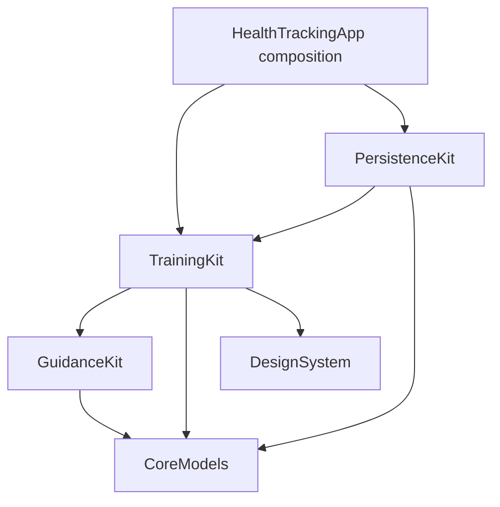
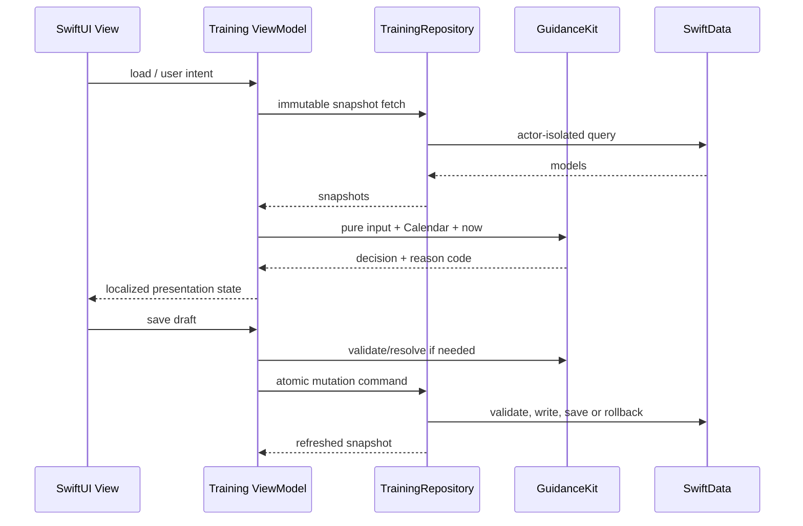

# M1 Bugün ve Antrenman — Yürütme Tasarımı

**Tarih:** 2026-08-20

**Durum:** Uygulama planı için onaylı

**Başlangıç SHA:** `87b5330e8288598ce33853967e830d183636cef1`

**Dal:** `feat/m1-training`

Bu belge, onaylı ana tasarımı değiştirmez. M1'i uygulanabilir sınırlara böler ve aşağıdaki kaynakları bağlayıcı kabul eder:

- `Saglik-Takip-App-Gereksinim-Dokumani-v1.md`
- `docs/superpowers/specs/2026-08-03-health-tracking-app-design.md`
- `docs/superpowers/plans/2026-08-03-health-tracking-app-roadmap.md`
- `docs/handoff/CONTINUE-M0-FOUNDATION.md`

Kullanıcı 2026-08-20 tarihinde dikey M1 yaklaşımı için “devam” onayı verdi. Aynı tarihte Gitea kesintisinin çalışmayı durdurmamasını, erişilebilen yerel/GitHub hattında hedefe kadar ilerlenmesini istedi.

---

## 1. Amaç ve kabul sınırı

M1 sonunda kullanıcı:

1. Uygulamayı açtığında en fazla bir saniye içinde bugünün seans, dinlenme, sürdürme veya deload direktifini görür.
2. Gün A/B/C programında ısınmadan özete kadar bir seansı kaydedebilir, yarım bırakabilir ve yeniden açılışta sürdürebilir.
3. Ağırlık, tekrar, süre, adım ve kalite temelli setleri geçerli ölçüm kurallarıyla kaydeder; geçersiz set SwiftData'ya ulaşmaz.
4. Çift progresyon, bodyweight, Pallof, OHP, ekipman tavanı, deload, faz ve PR kararlarının kısa gerekçesini görür.
5. Geçmiş seansı düzenlediğinde veya sildiğinde sonraki öneriler ve PR sonucu yeniden hesaplanır.
6. VoiceOver, Dynamic Type, Reduce Motion ve haptic kapatma tercihiyle aynı anlamlı akışı kullanabilir.

M1 kabulü; US1, US2, US3 ve US9'un otomatik testleri, UI kanıtı, bir haftalık A/B/C döngüsü, restore/history akışı ve roadmap M1 çıkış kapısının tamamıdır.

## 2. M1 dışında kalanlar

- Nutrition CRUD ve makro toplama M2'dir. M1 Today yalnız mevcut profil protein hedefini dürüst bir temel özeti olarak gösterebilir; tüketim uydurmaz ve çalışmayan öğün aksiyonu sunmaz.
- BodyMetric, Sleep, Mood, Posture CRUD ve health-check sonuç akışları M3'tür. M1 yalnız seed hatırlatmayı Today bağlamında salt okunur gösterebilir.
- Export ve rapor grafikleri M4'tür.
- HealthKit v1.1'dir.
- Rest timer, rozet, seri, puan, konfeti ve teşhis dili eklenmez.
- Bildirim izni veya gerçek cihaz CloudKit senkronu M1 başarısı olarak iddia edilmez.

---

## 3. Uygulama yaklaşımı

### 3.1 Seçilen yaklaşım: görev bazlı dikey dilimler

Roadmap'teki M1.1–M1.16 sırası korunur. Her görev, gerekli domain değeri, repository sözleşmesi, minimum UI bağlantısı ve kanıtı birlikte kapatır. Bu yaklaşım:

- her kural için bağımsız RED/GREEN kanıtı üretir;
- büyük bir “engine tamamlandı, UI sonra” entegrasyon birikimini önler;
- feature/repository sınırını gerçek kullanım üzerinden doğrular;
- her kabul edilen commit'in iki remote üzerinde izlenmesini mümkün kılar.

### 3.2 Reddedilen yaklaşımlar

**Engine-first büyük paket:** Saf kuralları erken tamamlar fakat repository ve UI varsayımlarını geç doğrular; görev başına kanıt zincirini büyütür.

**UI-first prototip:** Görsel ilerleme sağlar fakat kural mantığını view'lara sızdırma, sahte veri ve sonradan mimari düzeltme riski taşır.

---

## 4. Modül sınırları

### 4.1 `CoreModels`

- Kalıcı SwiftData entity'leri ve paylaşılan enum'lar burada kalır.
- `SetMeasurementValidator` tek ölçüm invariant kaynağıdır.
- UI metni, guidance gerekçesi veya view state barındırmaz.
- M1.4'te gerekirse yalnız session restore için yeni, CloudKit-uyumlu bir progress entity'si eklenir; mevcut entity alanları gizli string protokollerle aşırı yüklenmez.

### 4.2 `GuidanceKit`

Yeni library ve test target'ıdır. Kaynakları `SwiftUI`, `SwiftData`, `CloudKit`, `UIKit` veya repository import etmez.

Sorumlulukları:

- sıradaki seans ve dinlenme kararı;
- set ön-dolum ve progresyon önerisi;
- bodyweight ve haftalık Pallof seçimi;
- OHP semptom kapısı ve hafta varyantı;
- 20 kg tavanı ve Faz 3 ağır odak;
- zamanlı/reaktif deload;
- faz tahmini ve kullanıcı kararı için öneri;
- PR karşılaştırması;
- Today öncelik ve direktif bileşimi.

Motorlar yalnız immutable, `Equatable` ve `Sendable` input/output değerleri alır. `Date.now`, global `Calendar.current`, locale, singleton veya rastgelelik doğrudan kullanılmaz; tarih ve takvim çağrı girdisidir.

### 4.3 `TrainingKit`

- Repository protokollerinin sahibidir.
- SwiftData modellerini view'a doğrudan vermez; actor sınırında immutable snapshot'lara dönüştürür.
- `@MainActor @Observable` view model'ler loading/content/empty/error ve mutation durumlarını yönetir.
- Session draft doğrulamasını domain validator'a delege eder.
- Today, program, session deck, history ve edit/delete view'larını içerir.
- Haptic client protokolünü ve semantik olaylarını tanımlar; gerçek UIKit implementasyonu app composition'da enjekte edilir.

### 4.4 `PersistenceKit`

- TrainingKit repository protokollerinin SwiftData implementasyonlarını sağlar.
- Fetch, create, update, delete ve transaction sınırını tek `ModelContext` üzerinde uygular.
- Bir aktif program, program başına bir `ProgramState`, tek in-progress session ve session başına tek progress kaydı bütünlük kontrollerini yapar.
- Mutation önce domain doğrulamasından geçer; hata halinde rollback edilir.
- Seed sürüm geçişi, idempotence ve kullanıcı silmesini yeniden doğurmama davranışı burada kalır.

### 4.5 `HealthTrackingApp`

- Repository, guidance facade, haptic client ve clock/calendar bağımlılıklarını kurar.
- Feature kuralı içermez.
- Today ve Training root'larını yeni view model'lere geçirir; diğer üç tab'ın M0 davranışını bozmaz.

---

## 5. Domain veri akışı

Guidance çıktısı kullanıcıya gösterilecek serbest metin değil, kararlı reason code ve değerler taşır. Türkçe metin TrainingKit String Catalog'da eşlenir. Böylece motor lokalizasyondan bağımsız test edilir.

---

## 6. Repository sözleşmeleri

Mevcut `TrainingRepository` geriye uyumlu foundation okumalarından M1 sözleşmesine genişletilir. Büyük tek metot yerine aşağıdaki davranış kümeleri açık metotlarla temsil edilir:

### 6.1 Program ve Today okumaları

- profil, aktif program, fazlar, sıralı günler;
- günün bütün exercise/warmup/cooldown şablonları;
- aktif `ProgramState` için idempotent fetch-or-create;
- tek in-progress session;
- son tamamlanmış session ve geçerli hafta session'ları;
- pending health-check reminder özeti;
- Today için tek tutarlı snapshot.

Today yükü N+1 sorgu zinciri oluşturmaz. Repository tek snapshot üretir, guidance tek değerlendirme yapar ve view model ilk content state'i yayınlar.

### 6.2 Session mutation'ları

- planlanan session oluştur veya mevcut in-progress session'ı döndür;
- session'ı `inProgress`, `completed` veya `skipped` durumuna geçir;
- session progress'i atomik güncelle;
- doğrulanmış set ekle/düzenle/sil;
- recovery ve notu opsiyonel kaydet;
- session'ı yıkıcı onaydan sonra setleri/progress'iyle sil;
- tamamlanmış geçmişi ters kronolojik getir.

UI hiçbir mutation'da `ModelContext` görmez. Repository hata türleri kullanıcı metni içermez ve en az validation, not-found, illegal-transition, integrity ve save-failed ayrımını taşır.

### 6.3 Lifecycle invariant'ları

- En fazla bir `inProgress` session vardır.
- `completed` veya `skipped` session tekrar `inProgress` olmaz.
- `planned -> inProgress -> completed` normal akıştır.
- `planned -> skipped` mümkündür; `inProgress -> skipped` yerine kullanıcıya “Eksik bitir” veya “Seansı sil” sunulur.
- Session completion mevcut geçerli setleri korur; eksik setlere sahte kayıt eklemez.
- Her set `(sessionID, exerciseTemplateID, setIndex)` mantıksal anahtarında tektir.
- Set edit/delete sonrası guidance ve PR cache tutulmadan geçmişten yeniden hesaplanır.

---

## 7. Session restore tasarımı

`WorkoutSession.status` ve `SetLog` güvenli antrenman verisinin kaynağıdır. Kullanıcının tam akış konumunu ve ısınma/soğuma checklist ilerlemesini korumak için M1.4'te ayrı `WorkoutSessionProgress` modeli eklenir:

| Alan | Amaç |
|---|---|
| `workoutSessionId` | Session'a kararlı referans |
| `stage` | `warmup`, `movement`, `cooldown`, `summary` |
| `currentExerciseTemplateId` | Hareket deste konumu; opsiyonel |
| `completedWarmupItemIds` | Sürümlü JSON codec ile UUID kümesi |
| `completedCooldownItemIds` | Sürümlü JSON codec ile UUID kümesi |
| `warmupDisposition` | `pending`, `completed`, `skipped` |
| `cooldownDisposition` | `pending`, `completed`, `skipped` |

Model bütün scalar alanlara CloudKit-güvenli varsayılan verir ve session ilişkisini zorunlu relationship yerine UUID ile kurar. Repository session başına tek mantıksal kayıt garantisi, bozuk JSON reddi ve session silinince idempotent cleanup sağlar.

Yeni model `HealthTrackingSchemaV2` (`1.1.0`) ile eklenir; V1→V2 lightweight migration testi gerçek disk store üzerinde çalışır. Mevcut V1 model sınıfları değiştirilmediği için eski schema checksum'u korunur.

Restore önceliği:

1. In-progress session bulunursa onun progress snapshot'ı kullanılır.
2. Progress eksikse mevcut setlerden güvenli konum türetilir: hiç set yoksa warmup, aksi halde ilk tamamlanmamış hareket, bütün hedef setler varsa cooldown.
3. Referans edilen şablon silinmişse session silinmez; en yakın geçerli aşama açılır ve kullanıcıya kurtarılabilir açıklama gösterilir.
4. Her set ve progress mutation'ı ayrı güvenli save'dir; app background'a girerken yalnız bellekte veri bırakılmaz.

---

## 8. Tam seed tasarımı

M1 seed sürümü, M0 marker'ını tek seferlik sürüm 2'ye yükseltir:

- ana tasarım §4.1 tablosundaki 27 ayrı exercise;
- Curl ve Triceps için ayrı kayıtlar, ortak deterministik `supersetGroupId` ve sıralı `supersetOrder`;
- kaynak gereksinim §10.4'teki gün-özel raise/activate/potentiate warmup kayıtları;
- her güne bağlanan ortak üç cooldown hareketinin ayrı deterministik kayıtları;
- Ferritin, D vitamini ve Genel check-up reminder'ları;
- aktif program için ilk `ProgramState`.

Kurallar:

- Her seed nesnesinin kararlı UUID'si vardır.
- Marker 1 olan M0 kurulumu eksik M1 kataloğunu ekler ve marker 2 yazar.
- Marker 2 görüldüğünde seed tekrar koşmaz; kullanıcının sonradan sildiği veri yeniden doğmaz.
- Kısmi veya hatalı seed tek transaction'da rollback edilir.
- 27 exercise için ad, gün, sıra, measurement kind, progression rule, set/rep/RIR, starting weight, failure ve safety alanları fixture ile birebir doğrulanır.
- Pull-up rep ceiling nil kalır; bant kilogram değerine çevrilmez.
- Reminder tarihleri `installedAt` ve enjekte edilen `Calendar` ile deterministik üretilir; “yaklaşık” değer UI'da kesin tıbbi vade gibi sunulmaz.

---

## 9. Guidance motorları

### 9.1 Rotation ve Today direktifi

Karar sırası bağlayıcıdır:

1. In-progress session varsa `resume`.
2. Son tamamlanan güne göre A→B→C sıradaki gün bulunur; geçmiş yoksa A.
3. Aynı yerel günde tamamlanan session varsa `rest(.sameDay)`.
4. Son tamamlanan session önceki yerel gündeyse `rest(.consecutiveDay)`.
5. Yerel hafta tamamlanan session sayısı hedefe ulaştıysa `rest(.weeklyTargetReached)`.
6. Aksi halde `train(nextDay)`.

Rest kararı rotasyonu ilerletmez. Explicit override ayrı kullanıcı intent'i ve audit edilebilir session başlangıcıdır; motor kendi kendine override etmez.

Today alert önceliği: aktif semptom, OHP, deload, faz, bloodwork, ölçüm. Yalnız ilk alert açılır; kalan sayı gösterilir. Direktif ve gerekçe reason code üzerinden lokalize edilir.

### 9.2 Set draft ve ön-dolum

Ön-dolum sırası:

1. Guidance önerisi
2. Aynı session'ın önceki seti
3. Önceki tamamlanmış session'ın aynı set indeksi
4. Seed başlangıç değeri

Draft, measurement kind'a göre yalnız ilgili alanları açar. `RIR —` gerçek nil'dir. Save öncesinde `SetMeasurementValidator` çalışır; başarısız draft repository'ye gönderilmez. Kullanıcının override ettiği gerçek değer öneriden bağımsız olarak kaydedilir.

### 9.3 Strict double progression

Artış yalnız şu koşulların tümünde vardır:

- exercise'in `repHigh` değeri mevcut;
- son tamamlanmış session'daki bütün çalışma setleri `repHigh` değerine ulaşmış;
- bütün çalışma setlerinde RIR mevcut;
- bütün RIR değerleri `rir <= rirLow`;
- gerçek harici `weightKg` mevcut.

Sonuç son çalışma ağırlığı +2.5 kg, hedef tekrar `repLow` olur. Bir koşul eksikse ağırlık artmaz ve özgül reason code döner. `allowFailure` artış kuralını değiştirmez; yalnız güvenlik sunumunu etkiler.

### 9.4 Bodyweight ve Pallof

- Chin-up, Push-up ve Pull-up `bodyweightProgression` kullanır.
- Üst sınır yoksa motor sayı veya daha zor varyasyon uydurmaz.
- Üst sınır karşılanıp tanımlı ilerleme yoksa mevcut varyasyon korunur ve program ayarı gerektiği belirtilir.
- Haftalık Pallof seçimi iki uygun şablonun gerçek `performedVariant` geçmişinden hesaplanır.
- Aynı hafta Pallof yoksa sıradaki uygun exercise Pallof; varsa Plank varyantını önerir. Kullanıcı değiştirebilir.

### 9.5 OHP kapısı

- İlk OHP session'ı artış üretmez.
- Hafta 1–2 oturarak nötr, 3–4 ayakta nötr, 5+ ayakta standart varyant önerilir.
- Son OHP session'ı `symptomFree` değilse ağırlık artmaz.
- Cevap önceki OHP session'ına tarih ile yazılır.
- Güncel “Şu an semptom var” intent'i session'ı `symptomsPresent` yapar, OHP hareketini durdurur ve Half-Kneeling DB Press alternatifi sunar.
- M1 postür CRUD üretmez; semptom olayı session üzerinde kalır. M3 entegrasyon noktası açık protocol olarak bırakılır fakat sahte log yazılmaz.

### 9.6 Ekipman tavanı ve faz odağı

- Otomatik dambıl önerisi 20 kg üstüne çıkmaz.
- Tavanda öneri sırası tekrar, tempo, tek taraflı varyasyondur.
- Faz 3+ ve `boneFocusHeavy` için yalnız mevcut şablonun alt tekrar bandı öne çıkarılır.
- Motor belgede olmayan ağırlık artışı, tempo süresi veya rep aralığı üretmez.

### 9.7 Deload

- Scheduled: `trainingWeekIndex % 5 == 0`.
- Reactive: aynı exercise'in iki ardışık tamamlanmış session'ında ağırlık artmamış ve aynı ağırlıktaki toplam çalışma tekrarı yükselmemiş.
- Varsayılan aktif deload ağırlığı son ağırlığın yüzde 50'sidir; izin verilen açıklama yüzde 40–50 aralığıdır ve ekipman artışına yuvarlanır.
- Kullanıcı `accepted`, `stay`, `techniqueReview` veya `skipped` kararı verir.
- `techniqueReview` ve skip o hafta için tekrar uyarıyı bastırır; yeni hafta değerlendirmesi yeniden yapılır.
- `perceivedRecovery` algoritmaya girmez.

### 9.8 Faz geçişi

- Tahmin yalnız `programStartDate`, Calendar ve phase month aralığından gelir.
- Entry criteria ve milestone checklist olarak gösterilir; ölçülebilir yeni eşik eklenmez.
- Phase yalnız kullanıcı onayı veya manuel Settings seçimiyle değişir.
- “Şimdilik kal” sabit iki haftalık sessizlik yaratmaz; yalnız mevcut öncelikli kartı kapatır.

### 9.9 Personal record

- Weighted reps: tek merkezi Epley tahmini 1RM karşılaştırması.
- Bodyweight: yalnız aynı `performedVariant` için tekrar veya süre.
- Steps: aynı veya daha yüksek gerçek yükte adım.
- İlk geçerli kayıt baseline'dır ve PR kutlaması üretmez.
- Edit/delete sonrası bütün geçmiş yeniden değerlendirilir.
- Sunum ölçülüdür; konfeti, rozet, seri veya puan yoktur.

---

## 10. View-model ve ekran durumları

### 10.1 Today

`TodayViewModel` tek snapshot'tan şu state'leri üretir:

- loading;
- content(session/rest/resume/deload/phase/reminder varyantları);
- recoverable empty;
- recoverable error.

Default Dynamic Type'ta faz çizgisi, direktif, bağlam, tek alert ve ana eylem ilk viewport'ta kalır. Protein kartı yalnız profil hedefini gösterir; M2 öncesi tüketim miktarı veya ilerleme yüzdesi uydurmaz.

Soğuk açılış ölçümü app launch signpost'ından ilk anlamlı Today content'ine kadar yapılır. UI testi yalnız simülatör gözlemi değil, ölçüm ekini ve ≤1 saniye assertion'ını üretir; aşırı yüklü CI için tekrar ve medyan politikası uygulama planında sabitlenir.

### 10.2 Training root

- aktif program/faz;
- Gün A/B/C özetleri;
- varsa in-progress session;
- son session'lar;
- exercise detail ve trend;
- program düzenleme için Settings'e gerçek route.

### 10.3 Full-screen session deck

Sıra: OHP geçmiş semptom sorusu gerekiyorsa → warmup → movement kartları → cooldown → summary.

Her movement kartı hedef, öneri, kısa gerekçe, safety note, failure uyarısı, tamamlanan set listesi ve measurement-aware sabit kayıt çubuğunu taşır. Session içi dokunma alanı en az 52 pt'dir.

Set etkileşim bütçesi:

- öneriyi kaydet: 1 dokunuş;
- tek değer değiştir + kaydet: 2;
- RIR seç + kaydet: 2;
- çoklu override: açık numeric edit sheet; iki dokunuş şartı bu istisnaya uygulanmaz.

### 10.4 Interruption ve özet

- Kapatma gesture'ı doğrudan veri kaybetmez; sürdür, eksik bitir ve sil seçenekleri sunulur.
- Eksik bitir geçerli setleri korur ve eksikleri uydurmaz.
- Silme destructive confirmation ister.
- Recovery 1–10 ve note opsiyoneldir; boş değer yapay default almaz.
- Warmup/cooldown skip durumu özet içinde görünür.

### 10.5 History/edit/delete

- Session'lar ters kronolojik listelenir.
- Ayrıntı gerçek kayıtları ve guidance bağlamını gösterir.
- Set edit aynı validator'dan geçer.
- Set/session delete açık yıkıcı onay ister.
- Başarıdan sonra Today, history, progression ve PR state'i repository'den yeniden yüklenir.

---

## 11. Haptic sözleşmesi

TrainingKit'in enjekte edilen client'ı semantik olay alır:

| Olay | Haptic |
|---|---|
| set saved | medium impact |
| stepper changed | throttled selection |
| PR veya phase confirmed | success |
| safety stop veya deload | warning |
| validation/repository error | error |

`AppSetting` içindeki sürümlü `haptics.enabled` tercihi bütün olayları tek noktadan kapatır. Haptic hiçbir anlamın tek taşıyıcısı değildir. Test client olay sırasını, throttle clock'unu ve kill switch'i deterministik doğrular.

---

## 12. Erişilebilirlik, motion ve lokalizasyon

- Kullanıcı görünür her string catalog-backed olur; teknik hata açıklaması gösterilmez.
- VoiceOver Today'de faz+direktif+bağlamı tek özet olarak okur.
- Set satırı set numarası, hedef, gerçek ölçüm ve RIR'ı açık okur; edit/delete custom action'dır.
- Session başlıkları rotor ile bulunur ve ilk gerekli kontrol `AccessibilityFocusState` ile odaklanır.
- Dynamic Type xSmall–AX5'tir; AX3+ kayıt çubuğu dikey olur, sabit metin yüksekliği yoktur.
- Reduce Motion deck slide'ını 120 ms crossfade/list davranışına çevirir.
- Renk hiçbir durumu tek başına taşımaz; OHP, deload ve gün harfi metin/simgeyle yinelenir.
- Genel hedef 44 pt, session hedefi 52 pt; stepper kontrolleri arası en az 8 pt.
- Sayı/tarih/birim formatter ile locale-aware gösterilir; `kg`, tarih biçimi veya ondalık ayıracı view string'ine gömülmez.

Kabul matrisi light/dark, default/XXL/AX3/AX5, VoiceOver, Reduce Motion, yüksek kontrast, küçük iPhone ve modern standart iPhone'u kapsar.

---

## 13. Hata ve bütünlük davranışı

- Repository hatasında draft ve mevcut kullanıcı girdisi korunur; retry sunulur.
- Invalid measurement save butonu disabled olsa bile repository tekrar doğrular.
- Duplicate profile/program/state/in-progress session sessizce seçilmez; integrity error üretir.
- Silinmiş template referansı history'yi çökertmez; “Program öğesi artık mevcut değil” fallback'i gösterilir.
- Offline çekirdek akışı engellemez.
- Cloud yapılandırma hatası local'a sessiz fallback yapmaz.
- OHP safety stop veya deload kararı yalnız haptic/renkle anlatılmaz.
- UI-test injection gerçek repository/view-model yükleme yolunu kullanır; state doğrudan atanmaz.

---

## 14. Test stratejisi

### 14.1 Katmanlar

| Katman | M1 kanıtı |
|---|---|
| CoreModels | schema V2, progress codec/model, measurement invariants |
| GuidanceKit | rotation, strict RIR, bodyweight, Pallof, OHP, ceiling, deload, phase, PR |
| PersistenceKit | seed v2, CRUD, transitions, restore, uniqueness, rollback, migration |
| TrainingKit | Today/session/history view-model state ve intent'leri |
| App unit | dependency composition, haptic/settings wiring, launch state |
| UI | US1/2/3/9, set tap budget, resume/history, destructive confirmation |
| Accessibility | labels/order/actions, Dynamic Type, Reduce Motion |
| Performance | cold-launch first meaningful directive ≤1 s |

### 14.2 Katı görev döngüsü

Her M1.x görevi:

1. base SHA ve kapsam dosyalarını kaydeder;
2. yalnız beklenen davranışı ifade eden test-only commit üretir;
3. GitHub Actions'ta doğru nedenle RED alır;
4. minimum üretim davranışıyla aynı task commit'ini GREEN'e taşır;
5. target suite, tam Local suite, Release, Cloud compile ve statik kapıları çalıştırır;
6. bağımsız requirement/design/diff incelemesi yapar;
7. Critical/Important sıfırlandıktan sonra commit'i kabul eder;
8. exact SHA, run/job URL, test sayıları ve remote durumunu M1 evidence dosyasına yazar.

Fable erişilemiyorsa `NOT RUN` yazılır; yerine başka incelemeyi Fable diye adlandırmak yasaktır. GitHub Actions infrastructure/billing/zero-step hatası RED kanıtı değildir.

### 14.3 Remote kesintisi

- GitHub ve Gitea eşitse normal çift-push akışı sürer.
- Gitea kesilirse kullanıcı talimatıyla yerel/GitHub geliştirme durmaz.
- Her kabul edilen SHA için bekleyen Gitea push'u evidence ledger'da kaydedilir.
- Gitea döndüğünde canlı tip okunur; yalnız beklenen ancestor/tip üzerine normal push veya exact `--force-with-lease` yapılır.
- Bilinmeyen remote geçmişi overwrite edilmez.
- Milestone nihai kabulü, bütün ertelenmiş SHA'lar uzlaştırılmadan tamamlandı sayılmaz.

---

## 15. Görev dilimleri ve sahiplik

| Görev | Ana çıktı |
|---|---|
| M1.1 | Seed v2, 27 exercise, warmup/cooldown/reminder fixture |
| M1.2 | GuidanceKit target ve rotation/override |
| M1.3 | Measurement-aware draft ve çift katmanlı validation |
| M1.4 | Schema V2 progress, lifecycle, restore/interruption |
| M1.5 | Session deck ve hızlı set UI |
| M1.6 | Strict double progression |
| M1.7 | Bodyweight ve weekly Pallof |
| M1.8 | OHP gate ve safety stop |
| M1.9 | 20 kg ceiling ve phase focus |
| M1.10 | Scheduled/reactive deload state machine |
| M1.11 | Phase estimate/checklist/confirm/manual set |
| M1.12 | Deterministik PR detection |
| M1.13 | History/edit/delete/recalculation |
| M1.14 | Today variants ve cold-launch gate |
| M1.15 | Injected haptic client, throttle ve kill switch |
| M1.16 | Tam accessibility/UI/audit/evidence |

Package manifest ve app composition dosyaları yalnız ihtiyaç doğuran görevde değişir. M2 paralel başlatılmaz; M1'in aynı dosyaları değiştiren entegrasyon hattı tamamlandıktan sonra açılır.

---

## 16. Tasarım tamamlanma kontrolü

- [x] Onaylı ana tasarımla çelişmeyen modül yönü
- [x] M1.1–M1.16 için tekil sahiplik ve sıra
- [x] Local-first restore ve geçersiz set engeli
- [x] Bütün guidance kapıları ve edge-case davranışları
- [x] UI, accessibility, localization ve haptic sözleşmesi
- [x] Test/CI/evidence ve Gitea kesinti politikası
- [x] M2+ kapsam sızıntısı engeli

Bu belge uygulama ayrıntı planına geçmek için yeterlidir. Kod davranışının tek doğruluk kaynağı yine gereksinim ve onaylı ana tasarımdır; bu belgede çelişki görülürse onlar üstün gelir.
