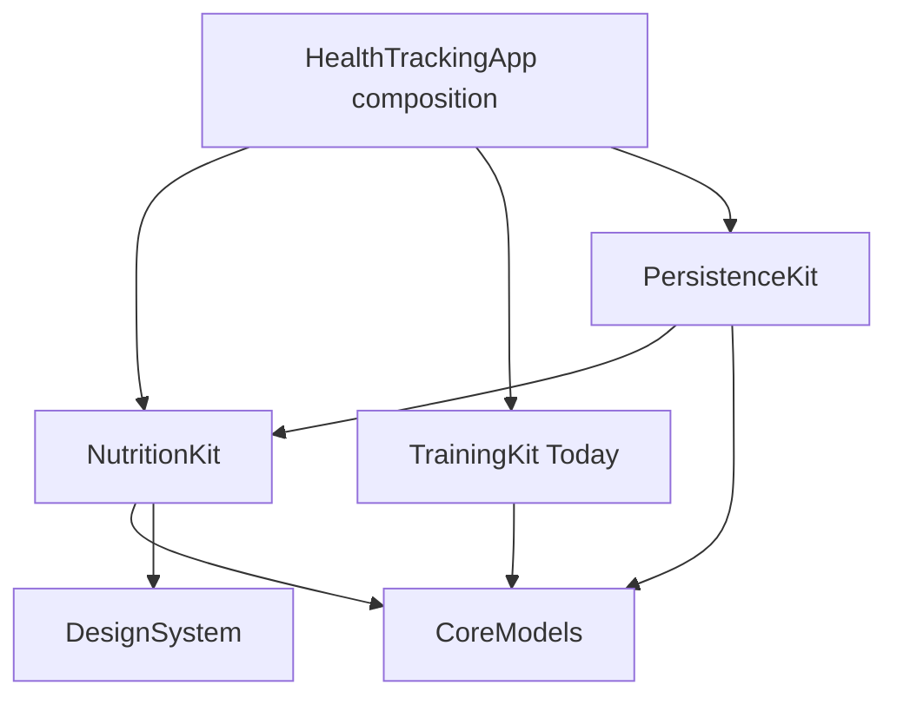

# M2 Beslenme — Yürütme Tasarımı

**Tarih:** 2026-08-21

**Durum:** Yürürlükte; M1 exact-SHA kabulü tamamlandı

**Başlangıç SHA:** `438d6da20f9412e7779bf703fab81f425e6b576b` · accepted M1.16 implementation `f2f04725307c119d0fe6c4aa7aa9bc328f3b04e4` için evidence-only successor · GitHub Actions [32488207271](https://github.com/Fatihzxc/ios_app/actions/runs/32488207271)

**Dal:** `feat/m2-nutrition`

Bu belge onaylı ana ürün tasarımını değiştirmez. M2'yi uygulanabilir sınırlara böler ve aşağıdaki kaynakları bağlayıcı kabul eder:

- `Saglik-Takip-App-Gereksinim-Dokumani-v1.md`
- `docs/superpowers/specs/2026-08-03-health-tracking-app-design.md`
- `docs/superpowers/plans/2026-08-03-health-tracking-app-roadmap.md`
- `docs/superpowers/specs/2026-08-20-m1-training-design.md`
- `docs/superpowers/plans/2026-08-03-m1-training-implementation.md`

Kullanıcının bağlayıcı çalışma talimatı sürer: görev hedefi tamamlanana kadar devam edilir; Gitea erişimi kesilirse kısa ve sınırlı denemeden sonra yerel/GitHub hattı beklemeden ilerler. Feature branch'ler tamamlandığında `main` dalına birleştirilir ve `main` CI ayrıca doğrulanır.

---

## 1. Amaç ve kabul sınırı

M2 sonunda kullanıcı:

1. Yerel takvim günleri arasında ileri/geri gider ve her yerel gün için tek mantıksal beslenme kaydı görür.
2. Kullanıcı tarafından oluşturulan Food kayıtlarını arar, ekler, düzenler ve siler.
3. Doğrudan makrolu Recipe/SavedMeal kayıtlarını yerleşik veya özel kategoriyle oluşturur, düzenler, arşivler, geri yükler ya da güvenliyse siler.
4. Recipe, Food veya ad-hoc kaynaktan bir MealEntry üretir; o andaki çözülmüş makrolar kaynak sonradan değişse veya silinse de geçmişte sabit kalır.
5. Kahvaltı, öğle, akşam ve ara öğün bölümleriyle gün/kategori toplamlarını; protein hedefini ve varsa kalori/karbonhidrat/yağ hedeflerini dürüst biçimde görür.
6. Kayıtlı bir tarifi kategori `+` veya Bugün hızlı eyleminden en fazla üç dokunuşta, varsayılan `1.0` porsiyonla ekler.
7. Aynı akışı VoiceOver, Dynamic Type, dark mode ve hata/yeniden deneme durumlarıyla kullanabilir.

M2 kabulü US4, US5, roadmap M2.1–M2.8 ve M2 çıkış kapısının tamamıdır.

## 2. M2 dışında kalanlar

- RecipeItem ve Food'lardan bileşimli tarif v1.1 kapsamıdır; M2 arayüzü yalnız direct-macro Recipe sunar.
- Barkod, harici besin veritabanı, kalori öneri motoru ve otomatik diyet tavsiyesi yoktur.
- HealthKit Food kaynağı geleceğe ayrılmıştır; M2 yalnız `.userCreated` kayıtları mutasyona açar.
- Beslenme uyum grafikleri M4.3'tür. M2 yalnız doğru günlük veri ve hedef sunumunu üretir.
- Öğün bildirimi M5.3'tür.
- Gerçek CloudKit cihazlar arası eşleme M5.6'dır; M2 Cloud scheme sonucu yalnız compile/configuration kanıtıdır.
- Rozet, seri, puan, ceza dili veya tıbbi/beslenme teşhisi eklenmez.

---

## 3. Uygulama yaklaşımı

### 3.1 Seçilen yaklaşım: repository-first dikey dilimler

Roadmap'teki M2.1–M2.8 sırası korunur. Gün kimliği ve repository bütünlüğü önce kurulur; Decimal tabanlı hesap onun üzerine gelir; Food, Recipe ve MealEntry davranışları ayrı görevlerde tamamlanır; gerçek gün ekranı ve üç dokunuş akışı son iki ürün dilimidir.

Bu sıra:

- SwiftData nesnelerini view katmanına sızdırmadan immutable snapshot sözleşmesini erken sabitler;
- binary floating-point toplam hatalarını UI'dan önce kapatır;
- Recipe/Food düzenlemesinin geçmiş snapshot'ını bozmadığını repository seviyesinde kanıtlar;
- hızlı ekleme testinin sahte veya geçici veri yoluna dayanmasını engeller.

### 3.2 Reddedilen yaklaşımlar

**Tek büyük NutritionRepository'yi M2.1'de tamamlamak:** Sonraki görevlerin davranışını erken ve testsiz uygular. Bunun yerine day, food, recipe ve meal-entry protokolleri ihtiyaç doğdukça eklenir; son bileşik repository bu küçük sözleşmelerden oluşur.

**Double ile UI'da toplama:** `0.1 + 0.2` gibi değerlerde kararsız toplam üretir ve farklı locale formatlarını hesap mantığına karıştırır. Hesap katmanı Decimal kullanır; Double yalnız mevcut SwiftData alanlarıyla sınır geçişidir.

**Recipe modeline sessiz `isArchived` alanı ekleme:** V1/V2 versioned schema aynı model tiplerini kullandığı için sürüm kimliğini değiştirmeden alan eklemek mevcut disk store'u için dürüst migration değildir. M2, donmuş model envanterini korur ve arşiv kimliklerini sürümlü `AppSetting` payload'ında tutar.

**Kaynağa canlı bağlı geçmiş:** Recipe/Food güncellenince eski gün toplamını değiştirir ve bağlayıcı snapshot gereksinimini ihlal eder. MealEntry çözülmüş makroların tek geçmiş kaynağıdır.

---

## 4. Modül sınırları



### 4.1 `CoreModels`

- Mevcut Food, Recipe, DailyNutritionLog, MealEntry, UserProfile, AppSetting ve MealCategory kalıcı tipleri korunur.
- Yeni kalıcı entity veya RecipeItem eklenmez.
- `MealCategory` validation hatası public ve test edilebilir olur; custom ad trim edilir, boş ad reddedilir, yerleşik kategori custom ad kabul etmez.
- UI state, repository hatası veya formatlanmış metin içermez.

### 4.2 `NutritionKit`

- Repository protokollerinin, immutable snapshot/request değerlerinin ve beslenme domain doğrulamasının sahibidir.
- Decimal makro hesabı, serving ölçekleme, hedefli/hedefsiz sunum ve sık tarif sıralamasını içerir.
- `@MainActor @Observable` view model'ler loading/content/empty/error ile mutation durumlarını yönetir.
- SwiftUI gün, Food, Recipe ve quick-add ekranlarını içerir.
- SwiftData veya `ModelContext` import etmez.

### 4.3 `PersistenceKit`

- NutritionKit protokollerinin `SwiftDataNutritionRepository` implementasyonunu sağlar.
- Aynı local gün için `0/1/>1` kayıt ayrımını yapar; `>1` durumda keyfi seçim yerine bütünlük hatası verir.
- UUID eşleşmelerinde de `0/1/>1` kontrolü yapar.
- Bütün mutation'lar validate edilir, transaction içinde kaydedilir ve hata halinde rollback edilir.
- Arşiv payload'ında duplicate AppSetting, bozuk JSON veya bilinmeyen schema version fail-closed davranır.

### 4.4 `HealthTrackingApp`

- Repository'yi, takvimi, clock/UUID bağımlılıklarını ve Nutrition view model'lerini kurar.
- Nutrition tab'ını gerçek köke bağlar.
- Bugün öğün hızlı eylemini tab seçimi ve Nutrition intent'iyle compose eder; makro hesabı veya kategori kuralı içermez.

TrainingKit ile NutritionKit birbirini import etmez. Bugün entegrasyonunda app target, Nutrition sunumunu TrainingKit'in küçük ve persistence-bağımsız `TodayNutritionPresentation` değerine map eder.

---

## 5. Sayısal sözleşme

### 5.1 Canonical makro değeri

`NutritionMacros` şu dört Decimal alanı taşır:

- `calories`
- `proteinG`
- `carbG`
- `fatG`

Tüm alanlar sonlu ve `>= 0` olmalıdır. Food fiber değeri ayrı opsiyonel Decimal alandır; MealEntry şemasında fiber snapshot alanı olmadığı için günlük dört-makro toplamına katılmaz.

### 5.2 Double sınırı

Kalıcı model alanları mevcut şemada Double'dır. Repository:

1. Double değer için `isFinite` ve işaret kontrolü yapar.
2. POSIX kısa decimal string üzerinden Decimal'a çevirir.
3. Hesabı yalnız Decimal ile yapar.
4. Kalıcı yazım sınırında sonlu Double'a çevirir ve sonucu tekrar doğrular.

NaN, `+∞`, `-∞`, negatif makro, sıfır/negatif serving veya quantity hiçbir zaman SwiftData mutation'ına ulaşmaz.

### 5.3 Ölçek ve yuvarlama

- Food makroları bir serving içindir; tüketilen quantity ile çarpılır.
- Recipe makroları tarifin toplam yield'i içindir; `consumedServings / recipe.servings` oranıyla ölçeklenir.
- Ad-hoc makrolar girilen quantity için nihai tüketilmiş toplamdır; tekrar ölçeklenmez.
- Bölme sonucu kalıcı snapshot'a yazılırken altı ondalık basamağa banker rounding uygulanır. UI formatlama bu doğruluk kaynağını değiştirmez.
- Gün ve kategori toplamı çözülmüş MealEntry snapshot'larının Decimal toplamıdır.

`0.1 + 0.2 == 0.3` contract testi toleranssız geçmelidir.

### 5.4 Hedef sunumu

Protein hedefi profile'daki pozitif değerden gelir. Kalori, karbonhidrat ve yağ hedefleri opsiyoneldir:

- hedef varsa toplam, hedef ve oran gösterilir;
- hedef yoksa yalnız toplam gösterilir, sahte `0` hedef veya yüzde üretilmez;
- bar görsel olarak `0...1` aralığında clamp edilebilir fakat erişilebilir etiket gerçek toplam/hedefi söyler.

---

## 6. Repository sözleşmeleri ve bütünlük

Küçük protokoller görevlerle birlikte eklenir:

- `NutritionDayRepository`: profile target okuma, day fetch, fetch-or-create ve day delete.
- `FoodLibraryRepository`: query, create, update, delete.
- `RecipeLibraryRepository`: active/archived query, create, update, remove ve restore.
- `MealEntryRepository`: source-resolved create, snapshot-preserving update, delete ve usage query.

M2.5 sonunda `NutritionRepository` bu protokolleri birleştirir. Her protokol `@MainActor`; bütün public değerler `Equatable` ve `Sendable` olur.

Repository şu hataları teknik ayrıntı sızdırmadan ayırır:

- missing record;
- duplicate ID;
- duplicate logical day;
- invalid request;
- invalid persisted value/source shape;
- archived source;
- unsupported mutation source;
- load/save/delete failure.

SwiftData/Core Data hata metni doğrudan kullanıcıya gösterilmez.

---

## 7. Yerel gün semantiği

Repository `Calendar` bağımlılığını init ile alır. Üretim `.autoupdatingCurrent`, testler sabit timezone kullanır.

Bir gün aralığı `calendar.dateInterval(of: .day, for: date)` ile hesaplanır. `+ 86_400 saniye` kullanılmaz; DST geçişleri ve timezone değişimleri test edilir.

`fetchOrCreate` davranışı:

1. Seçili tarihi kapsayan local day interval'ını bulur.
2. Aralıktaki tüm DailyNutritionLog kayıtlarını alır.
3. Sıfırsa `interval.start` ile bir kayıt oluşturur.
4. Birse onu döndürür; eski non-normalized tarih varsa transaction içinde `interval.start`a normalize eder.
5. Birden fazlaysa ID'leriyle bütünlük hatası verir; merge veya rastgele seçim yapmaz.

Day silme, ilişkide `.nullify` kullanıldığı için önce child MealEntry'leri sonra DailyNutritionLog'u transaction içinde siler; orphan bırakmaz.

---

## 8. Food kütüphanesi

Food draft invariant'ları:

- trim edilmiş ad ve serving unit boş olamaz;
- serving size pozitif/sonlu;
- calories/protein/carb/fat sıfır veya pozitif/sonlu;
- fiber nil ya da sıfır veya pozitif/sonlu;
- boş brand nil'e normalize edilir;
- M2 mutasyonlarında source daima `.userCreated` olur.

Arama ad ve brand üzerinde locale-independent case/diacritic-insensitive normalize edilmiş eşleşmedir. Sonuçlar normalize ad, brand ve UUID ile deterministik sıralanır. `.healthKit` kayıtları gelecekte okunabilir fakat M2 edit/delete yolunda açık `unsupportedMutationSource` hatası verir.

Food silme geçmiş MealEntry'yi silmez; snapshot makrolar kalır. Kaynak adı bulunamazsa geçmiş satır lokalize “Silinmiş besin” fallback'i kullanır.

---

## 9. Direct-macro Recipe kütüphanesi

Recipe draft invariant'ları:

- trim edilmiş ad boş olamaz;
- `isDirectMacros == true` zorunludur;
- yield `servings > 0` ve sonludur;
- toplam dört makro sıfır veya pozitif/sonludur;
- boş note nil'e normalize edilir;
- MealCategory canonical validation'dan geçer.

Arşiv state'i `AppSetting.key == "nutrition.recipe.archive"` altında strict JSON taşır:

```json
{"schemaVersion":1,"recipeIDs":["..."]}
```

UUID'ler lexicographic sıralı ve tekildir. Duplicate setting, duplicate ID, malformed JSON, unknown key veya version hata üretir.

`removeRecipe(id:)`:

- herhangi bir MealEntry o Recipe ID'sini taşıyorsa hard delete yerine arşivler;
- referans yoksa Recipe'yi siler ve varsa stale archive ID'yi temizler;
- sonucu `.archived` veya `.deleted` olarak döndürür.

Arşivli tarif quick-add ve active library'de görünmez; archived bölümünden geri yüklenebilir. Arşivleme geçmiş MealEntry snapshot'ını değiştirmez.

---

## 10. MealEntry snapshot sözleşmesi

Create request tam olarak bir kaynak taşır:

- `.recipe(id, consumedServings)`
- `.food(id, quantity)`
- `.adhoc(name, quantity, resolvedMacros)`

Repository daily log ve kaynak için exact `0/1/>1` kontrolü yapar. Recipe arşivliyse yeni quick-add reddedilir. Başarılı create tek transaction içinde şu alanları yazar:

- kategori;
- yalnız ilgili `recipeId` veya `foodId`;
- ad-hoc ise trim edilmiş `adhocName`;
- pozitif quantity;
- dört çözülmüş snapshot makro;
- injected `loggedAt`, `createdAt`, `updatedAt`;
- DailyNutritionLog ilişkisi ve log `updatedAt` değeri.

Kaynak daha sonra değiştirildiğinde veya silindiğinde MealEntry okunurken makrolar yeniden çözülmez.

Var olan entry quantity düzenlemesi de canlı kaynağa dönmez: yeni/önceki quantity oranı, entry'nin kendi snapshot makrolarına uygulanır. Kategori-only güncelleme makroları aynen korur. Geçersiz veya sıfır eski quantity bütünlük hatasıdır.

---

## 11. Gün ekranı ve view-model durumları

`NutritionDayViewModel` şu durumları ayırır:

- `.loading`
- `.empty(dayPresentation)` — geçerli gün/target var, entry yok
- `.content(dayPresentation)`
- `.error(retryContext)`

Gün değiştirirken eski gün içeriği yeni gün diye etiketlenmez. Önceki/sonraki ve DatePicker intent'i calendar ile normalize edilir; load yarışlarında yalnız son request state yayınlar.

Gün ekranı:

- tarih başlığı, önceki/sonraki ve tarih seçimi;
- dört makro özeti;
- Kahvaltı, Öğle, Akşam, Ara Öğün sabit bölümleri;
- yalnız veri varsa custom kategori bölümleri;
- her bölümde entry satırları, kategori toplamı ve 52 pt `+` aksiyonu;
- Food ve Recipe kütüphanelerine gerçek navigation;
- loading, empty, recoverable error ve mutation error sunumu içerir.

Entry listesi `loggedAt`, `createdAt`, UUID; custom kategoriler normalize ad ile deterministik sıralanır.

---

## 12. Üç dokunuş ve Bugün entegrasyonu

Kategori `+` akışı:

1. Kategori `+`.
2. Tarif satırındaki `+`.
3. `1.0` porsiyon ön-dolu onay `Ekle`.

Bugün `Öğün ekle` akışı da üç dokunuştur; ilk tap Nutrition tab'ına geçer ve saate göre kategori intent'i açar. Varsayılan saat eşlemesi injected calendar ile:

- 05:00–10:59 kahvaltı;
- 11:00–15:59 öğle;
- 16:00–21:59 akşam;
- diğer saatler ara öğün.

Kullanıcı confirmation ekranında kategori/quantity değiştirebilir; bu override dokunuşları üç-tap kabul hesabına dahil değildir.

Quick-add tarifleri seçili kategoriyle filtrelenir ve:

1. kullanım sayısı azalan;
2. son kullanım tarihi azalan;
3. normalize ad;
4. UUID

sırasıyla sunulur. Arşivliler yoktur.

Confirm intent optimistic olarak geçici entry ve toplamı yayınlar. Repository başarısında canonical snapshot ile değiştirilir; hatada geçici entry geri alınır, seçim korunur ve açık retry gösterilir. Aynı intent iki kez onaylanırsa aynı request ID nedeniyle duplicate üretmez.

Bugün ekranındaki beslenme kartı protein toplamını hedefe karşı, diğer makroları hedef var/yok kuralına göre gösterir. Nutrition yükü Today ana antrenman direktifinin `<= 1 s` yayınını bloke etmez.

---

## 13. Erişilebilirlik, lokalizasyon ve gizlilik

- Tüm kullanıcı metni String Catalog'dadır; raw enum/SwiftData/error metni görünmez.
- Tarih ve sayılar kullanıcı locale'iyle formatlanır; hesap/export kaynak değerleri locale'den bağımsızdır.
- Buton ve seçim hedefleri en az 52×52 pt; anlam yalnız renk veya bar doluluğuna bırakılmaz.
- VoiceOver gün özeti toplam/hedefi tek anlamlı cümlede, kategori başlıkları header trait'iyle, quick-add satırları ad + serving + makro özetiyle okur.
- Dynamic Type AX5'te özet ve form kontrolleri yatay kırpılmaz; gerektiğinde dikey stack/scroll kullanılır.
- Reduce Motion'da optimistic insert ve sheet geçişleri kısa opacity ile sınırlanır.
- Sağlık/beslenme verisi loglanmaz; test fixture'ları sentetiktir. M2 ağ isteği veya üçüncü taraf analytics eklemez.

---

## 14. Test ve kanıt stratejisi

| Katman | M2 kanıtı |
|---|---|
| CoreModels | MealCategory canonical validation ve donmuş schema inventory |
| NutritionKit | Decimal math, validation, target presentation, view-model state, frequency sorting |
| PersistenceKit | day uniqueness/DST, Food/Recipe CRUD, archive codec, snapshot immutability, rollback |
| App unit | repository/view-model composition ve Today route wiring |
| UI | Food/Recipe CRUD, day navigation, category totals, ad-hoc ve üç-tap quick-add |
| Accessibility | VoiceOver semantics, 52 pt, light/dark, XXL/AX3/AX5 |
| Relaunch | disk store identifier ile day/entry/recipe state devamlılığı |

Her M2.x görevi M1'deki strict döngüyü sürdürür:

1. test-only RED commit;
2. eksik davranış nedeniyle hosted RED;
3. aynı commit amend ile minimum GREEN;
4. exact-SHA full Local suite, Release, Cloud compile, screenshot/hygiene;
5. requirement/design/diff review ve sıfır Critical/Important;
6. exact remote/evidence kaydı.

Gitea outage aynı talimatla bekleme nedeni değildir. Fable erişilemiyorsa `NOT RUN` yazılır; başka inceleme Fable diye adlandırılmaz.

---

## 15. Görev dilimleri ve sahiplik

| Görev | Ana çıktı |
|---|---|
| M2.1 | Nutrition target/test target, day snapshots/protocol, SwiftData day uniqueness |
| M2.2 | Decimal macro/validation/target presentation |
| M2.3 | User-created Food repository, view model ve library UI |
| M2.4 | Direct Recipe, MealCategory, archive/delete/restore ve library UI |
| M2.5 | Recipe/Food/ad-hoc snapshot create/update/delete |
| M2.6 | Calendar day UI, categories, totals ve state handling |
| M2.7 | Frequent recipe ordering, optimistic three-tap ve Today route |
| M2.8 | Timezone/relaunch/accessibility/full US4-US5 audit ve evidence |

M3 paralel başlatılmaz; M2.8 accepted exact tree tamamlandıktan sonra `feat/m3-trackers` açılır.

---

## 16. Tasarım tamamlanma kontrolü

- [x] US4/US5 ve M2.1–M2.8 sahipliği
- [x] Decimal-safe math ve mevcut Double persistence sınırı
- [x] Local-day/DST/timezone uniqueness davranışı
- [x] Food ve direct-macro Recipe validation/CRUD
- [x] Donmuş schema'yı bozmayan arşiv politikası
- [x] Kaynak değişiminden bağımsız MealEntry snapshot'ı
- [x] Hedefli/hedefsiz gün sunumu ve optimistic üç-tap akış
- [x] Today entegrasyonunun M1 launch direktifini bloke etmemesi
- [x] Accessibility, localization, CI/evidence ve remote outage politikası

Bu belge ayrıntılı uygulama planına geçmek için yeterlidir. Çelişkide gereksinim dokümanı ve onaylı ana tasarım üstündür.
